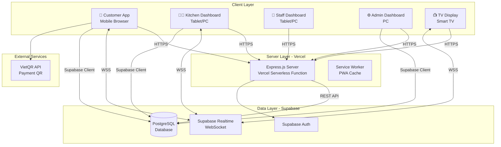
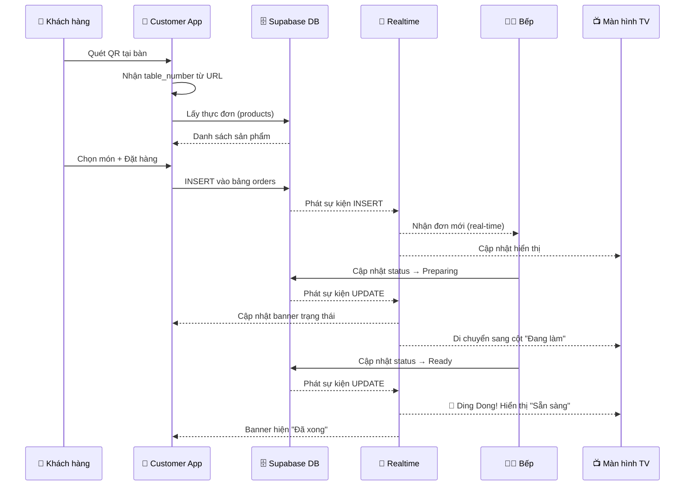

# BÁO CÁO DỰ ÁN

# HỆ THỐNG ĐẶT HÀNG QR CODE – NOHOPE COFFEE

---

**Tên dự án:** Nohope Coffee – Hệ thống đặt hàng trực tuyến bằng mã QR  
**Phiên bản:** 1.0.0  
**Nền tảng:** Web Application (Progressive Web App)  
**Ngày báo cáo:** 28/03/2026

---

## MỤC LỤC

1. [Tổng quan dự án](#1-tổng-quan-dự-án)
2. [Mục tiêu và Phạm vi](#2-mục-tiêu-và-phạm-vi)
3. [Công nghệ sử dụng](#3-công-nghệ-sử-dụng)
4. [Kiến trúc hệ thống](#4-kiến-trúc-hệ-thống)
5. [Thiết kế Cơ sở dữ liệu](#5-thiết-kế-cơ-sở-dữ-liệu)
6. [Phân tích chức năng chi tiết](#6-phân-tích-chức-năng-chi-tiết)
7. [Cấu trúc mã nguồn](#7-cấu-trúc-mã-nguồn)
8. [Giao diện người dùng](#8-giao-diện-người-dùng)
9. [Bảo mật hệ thống](#9-bảo-mật-hệ-thống)
10. [Triển khai và Vận hành](#10-triển-khai-và-vận-hành)
11. [Kết luận](#11-kết-luận)

---

## 1. TỔNG QUAN DỰ ÁN

### 1.1 Giới thiệu

**Nohope Coffee** là một hệ thống quản lý và đặt hàng trực tuyến được thiết kế dành riêng cho mô hình quán cà phê. Hệ thống cho phép khách hàng quét mã QR tại bàn để đặt món trực tiếp trên điện thoại, đồng thời đồng bộ đơn hàng theo thời gian thực (real-time) tới bếp, quầy phục vụ và màn hình TV hiển thị trạng thái.

### 1.2 Bối cảnh

Trong bối cảnh chuyển đổi số ngành F&B, nhu cầu giảm thiểu nhân viên tiếp nhận order, tang trải nghiệm khách hàng và quản lý dữ liệu kinh doanh là rất cao. Hệ thống Nohope Coffee được xây dựng để giải quyết toàn bộ các bài toán trên trong một nền tảng web duy nhất.

### 1.3 Đặc điểm nổi bật

| # | Tính năng | Mô tả |
|---|-----------|-------|
| 1 | Đặt hàng bằng QR | Khách quét mã QR → hiển thị thực đơn → đặt món → thanh toán |
| 2 | Đồng bộ thời gian thực | Sử dụng Supabase Realtime (WebSocket) để đồng bộ đơn hàng ngay lập tức |
| 3 | Quản lý tồn kho tự động | Tự động trừ nguyên liệu dựa trên công thức (recipe) khi hoàn thành đơn |
| 4 | Hỗ trợ đa ngôn ngữ | Tiếng Việt và Tiếng Anh (i18n) |
| 5 | Progressive Web App | Có thể cài đặt như ứng dụng trên điện thoại di động |
| 6 | Phân quyền nhân viên | Hệ thống phân quyền chi tiết theo từng tab chức năng |
| 7 | Sổ quỹ (Cashflow) | Quản lý thu chi tổng hợp từ đơn hàng và phiếu nhập kho |

---

## 2. MỤC TIÊU VÀ PHẠM VI

### 2.1 Mục tiêu

- **Tối ưu hóa quy trình đặt hàng:** Loại bỏ bước ghi order thủ công, giảm sai sót.
- **Đồng bộ dữ liệu real-time:** Bếp nhận đơn ngay khi khách đặt, không cần in bill riêng.
- **Quản lý kho thông minh:** Tự động cảnh báo tồn kho thấp, trừ nguyên liệu theo đơn hàng.
- **Phân tích kinh doanh:** Dashboard thống kê doanh thu, feedback khách hàng, lịch sử đơn hàng.
- **Chương trình khách hàng thân thiết:** Tích điểm, phân hạng thành viên (Bronze → Silver → Gold → Diamond).

### 2.2 Phạm vi hệ thống

Hệ thống bao gồm **6 giao diện (module)** chính:

| Module | Người dùng | Mục đích |
|--------|-----------|----------|
| **Customer App** | Khách hàng | Xem thực đơn, đặt món, thanh toán |
| **Kitchen Dashboard** | Nhân viên bếp | Nhận và xử lý đơn hàng |
| **Staff Dashboard** | Nhân viên phục vụ | Quản lý bàn, yêu cầu phục vụ |
| **Admin Dashboard** | Quản trị viên | Quản lý toàn bộ hệ thống |
| **TV Display** | Màn hình hiển thị | Hiện trạng thái đơn cho khách |
| **Login Page** | Tất cả nhân viên | Xác thực bằng mã PIN |

---

## 3. CÔNG NGHỆ SỬ DỤNG

### 3.1 Bảng tổng hợp công nghệ

| Thành phần | Công nghệ | Phiên bản | Vai trò |
|------------|-----------|-----------|---------|
| **Backend Runtime** | Node.js | LTS | Chạy server Express |
| **Web Framework** | Express.js | 5.2.1 | Xử lý routing, middleware |
| **Database** | PostgreSQL (Supabase) | — | Lưu trữ dữ liệu chính |
| **BaaS** | Supabase | — | Auth, Realtime, REST API |
| **Frontend** | Vanilla HTML/JS/CSS | — | Giao diện người dùng |
| **CSS Framework** | Tailwind CSS | 3.4 | Utility-first styling |
| **Authentication** | JWT + Supabase Auth | — | Xác thực người dùng |
| **Hosting** | Vercel | — | Deploy serverless |
| **Thanh toán** | VietQR API | — | Tạo mã QR chuyển khoản |
| **PWA** | Service Worker | — | Offline caching |

### 3.2 Thư viện và Dependencies

**Production Dependencies:**
```
@supabase/supabase-js  ^2.99.2   — Supabase client SDK
dotenv                 ^17.3.1   — Quản lý biến môi trường
express                ^5.2.1    — Web framework
jsonwebtoken           ^9.0.3    — JWT token generation
```

**Development Dependencies:**
```
tailwindcss            3.4       — CSS utility framework
postcss                ^8.5.8    — CSS post-processor
autoprefixer           ^10.4.27  — CSS vendor prefixing
jest                   ^30.3.0   — Testing framework
supertest              ^7.2.2    — HTTP testing
```

### 3.3 CDN Libraries (Client-side)

- **Supabase JS Client** – kết nối trực tiếp từ trình duyệt tới Supabase
- **Bootstrap 5** – UI framework cho Admin Dashboard
- **Font Awesome 6** – Icon library
- **Google Fonts** (Plus Jakarta Sans, Inter) – Typography

---

## 4. KIẾN TRÚC HỆ THỐNG

### 4.1 Sơ đồ kiến trúc tổng quan



### 4.2 Mô hình hoạt động

Hệ thống sử dụng kiến trúc **Client-heavy** (BaaS Pattern):

1. **Express.js** chỉ phục vụ trang HTML tĩnh + xử lý webhook thanh toán
2. **Supabase Client JS** được load trực tiếp trên browser, gọi database từ client
3. **Supabase Realtime** dùng WebSocket để đồng bộ đơn hàng giữa tất cả client
4. **Vercel** triển khai hệ thống dưới dạng Serverless Function

### 4.3 Luồng đặt hàng (Order Flow)



---

## 5. THIẾT KẾ CƠ SỞ DỮ LIỆU

### 5.1 Sơ đồ ERD (Entity Relationship Diagram)

```mermaid
erDiagram
    PRODUCTS {
        UUID id PK
        TEXT name
        TEXT category
        NUMERIC price
        NUMERIC promotional_price
        TIMESTAMPTZ promo_start_time
        TIMESTAMPTZ promo_end_time
        TEXT description
        TEXT image_url
        BOOLEAN is_available
        BOOLEAN is_best_seller
        JSONB recipe
        JSONB options
        TIMESTAMPTZ created_at
    }

    INGREDIENTS {
        UUID id PK
        TEXT name
        TEXT unit
        NUMERIC stock
        NUMERIC low_stock_threshold
        TEXT supplier_name
        TEXT supplier_contact
        TIMESTAMPTZ last_restock_date
        TIMESTAMPTZ created_at
    }

    ORDERS {
        UUID id PK
        TEXT table_number
        TEXT session_id
        TEXT customer_phone
        INTEGER earned_points
        JSONB items
        NUMERIC total_price
        TEXT discount_code
        NUMERIC discount_amount
        TEXT order_note
        BOOLEAN is_paid
        TEXT payment_method
        TEXT payment_status
        TEXT status
        TIMESTAMPTZ created_at
    }

    CUSTOMERS {
        UUID id PK
        TEXT phone
        TEXT name
        TEXT tier
        INTEGER current_points
        NUMERIC total_spent
        TIMESTAMPTZ created_at
    }

    INVENTORY_LOGS {
        UUID id PK
        UUID ingredient_id FK
        TEXT change_type
        NUMERIC amount
        NUMERIC previous_stock
        NUMERIC new_stock
        TEXT reference_id
        TEXT reason
        TIMESTAMPTZ created_at
    }

    USERS {
        UUID id PK
        TEXT name
        TEXT pin
        TEXT role
        TIMESTAMPTZ created_at
    }

    DISCOUNTS {
        UUID id PK
        TEXT code
        TEXT discount_type
        NUMERIC value
        INTEGER usage_limit
        INTEGER used_count
        BOOLEAN active
        TIMESTAMPTZ created_at
    }

    FEEDBACK {
        UUID id PK
        UUID order_id FK
        INTEGER rating
        TEXT comment
        TEXT table_number
        TIMESTAMPTZ created_at
    }

    TABLE_SESSIONS {
        UUID id PK
        TEXT table_number
        TEXT session_id
        TEXT device_info
        TIMESTAMPTZ last_seen
        TIMESTAMPTZ created_at
    }

    STAFF_REQUESTS {
        UUID id PK
        TEXT table_number
        TEXT type
        TEXT status
        TIMESTAMPTZ created_at
    }

    POINT_LOGS {
        UUID id PK
        UUID customer_id FK
        INTEGER amount
        TEXT reason
        TIMESTAMPTZ created_at
    }

    CASH_TRANSACTIONS {
        UUID id PK
        TEXT type
        NUMERIC amount
        TEXT category
        TEXT description
        TIMESTAMPTZ created_at
        TEXT created_by
    }

    AUDIT_LOGS {
        UUID id PK
        TEXT admin_identifier
        TEXT action
        JSONB details
        TIMESTAMPTZ created_at
    }

    ORDERS ||--o{ FEEDBACK : "has"
    CUSTOMERS ||--o{ POINT_LOGS : "earns"
    INGREDIENTS ||--o{ INVENTORY_LOGS : "tracked by"
```



### 5.2 Mô tả chi tiết các bảng

#### 5.2.1 Bảng `products` – Quản lý sản phẩm

Lưu trữ thông tin từng món trong thực đơn. Đặc biệt:
- **`recipe` (JSONB):** Công thức nguyên liệu, mảng các `{ingredientId, quantity}`. Dùng để tính toán trừ kho tự động.
- **`options` (JSONB):** Các tùy chọn biến thể (size, đường, đá...), mỗi option có nhiều choice, mỗi choice có `priceExtra` và tùy chọn `recipe` riêng.
- **`promotional_price`:** Giá khuyến mãi có thời gian hiệu lực (`promo_start_time` → `promo_end_time`).

#### 5.2.2 Bảng `orders` – Đơn hàng

Lưu toàn bộ đơn hàng với:
- **`status`:** Pending → Preparing → Ready → Completed / Cancelled
- **`items` (JSONB):** Danh sách món đã chọn bao gồm số lượng, options, giá.
- **`session_id`:** Để nhận diện phiên đặt hàng (mỗi tab/browser một session riêng).
- **`payment_method`:** `cash` (tiền mặt) hoặc `transfer` (chuyển khoản).

#### 5.2.3 Bảng `ingredients` – Nguyên liệu

Quản lý kho nguyên liệu:
- **`stock`:** Số lượng tồn kho hiện tại
- **`low_stock_threshold`:** Ngưỡng cảnh báo sắp hết
- **`supplier_name` / `supplier_contact`:** Thông tin nhà cung cấp

#### 5.2.4 Bảng `inventory_logs` – Nhật ký kho

Ghi lại mỗi lần thay đổi tồn kho:
- **`change_type`:** `deduction` (xuất kho), `restock` (nhập kho), `spoilage` (hao hụt), `adjustment` (điều chỉnh)
- **`previous_stock` / `new_stock`:** Lưu mức tồn trước và sau để audit

#### 5.2.5 Bảng `customers` – Khách hàng thành viên

Chương trình loyalty:
- **`tier`:** Bronze (< 500K) → Silver (500K+) → Gold (2M+) → Diamond (5M+)
- **`current_points`:** Điểm tích lũy hiện tại
- **`total_spent`:** Tổng chi tiêu lịch sử

#### 5.2.6 Bảng `cash_transactions` – Sổ quỹ

Thu chi nội bộ:
- **`type`:** `income` (thu) hoặc `expense` (chi)
- **`category`:** Phân loại giao dịch (Bán hàng, Nhập kho, Lương, ...)

#### 5.2.7 Bảng `users` – Nhân viên

Xác thực nhân viên bằng mã PIN:
- **`role`:** `admin`, `staff`, `kitchen`, `manager`
- **`pin`:** Mã PIN duy nhất cho mỗi nhân viên

#### 5.2.8 Stored Procedure – `place_order_and_deduct_inventory`

Hàm PostgreSQL đảm bảo tính **atomic** (nguyên tử) khi đặt hàng:
1. Kiểm tra tồn kho tất cả nguyên liệu cần thiết
2. Nếu đủ → trừ kho + ghi log + tạo đơn hàng (một transaction duy nhất)
3. Nếu thiếu → raise exception, không có thay đổi nào xảy ra

---

## 6. PHÂN TÍCH CHỨC NĂNG CHI TIẾT

### 6.1 Module Khách hàng (Customer App)

**File chính:** `public/pages/index.html`, `public/js/customer.js` (~1,974 dòng)

#### 6.1.1 Quét QR và Nhận diện bàn

```
URL: https://domain.com/?table=5
```

- Khách quét QR code → trình duyệt mở URL chứa tham số `table`
- Hệ thống tự động nhận số bàn từ URL query parameter

#### 6.1.2 Table Locking (Khóa bàn)

- Mỗi tab trình duyệt tạo một `session_id` duy nhất
- Khi mở trang, hệ thống kiểm tra bảng `table_sessions`:
  - Nếu bàn đang có session khác **hoạt động** (last_seen < 5 phút) → Hiện overlay "Bàn đang được sử dụng"
  - Nếu session cũ **stale** (> 5 phút) → Chiếm bàn
  - Nếu chưa có session → Tạo mới
- Heartbeat mỗi 60 giây để duy trì khóa
- Giải phóng khóa khi đóng tab (`beforeunload`)

#### 6.1.3 Thực đơn và Giỏ hàng

- **Hiển thị sản phẩm:** Grid card responsive, hỗ trợ ảnh lazy-loading
- **Tìm kiếm:** Tìm theo tên và mô tả sản phẩm
- **Lọc danh mục:** Filter theo category (All, Cà phê, Trà, Đồ ăn...)
- **Tùy chọn món:** Modal chọn size, đường, đá... với giá bổ sung
- **Kiểm tra tồn kho real-time:** So sánh recipe với stock → disable nút thêm nếu hết nguyên liệu
- **Giỏ hàng:** Bottom sheet iOS-style, sửa số lượng bằng input, hiện tổng tiền

#### 6.1.4 Thanh toán

- **Tiền mặt:** Đặt đơn → trạng thái Pending → nhân viên thu tiền
- **Chuyển khoản:** Tích hợp VietQR API → tạo QR code động với:
  - Số tài khoản ngân hàng (TPBank)
  - Số tiền chính xác
  - Nội dung chuyển khoản = 8 ký tự đầu của Order ID
- **Webhook xác nhận:** Server nhận callback từ SePay/Casso → so khớp nội dung CK → đánh dấu `is_paid = true`

#### 6.1.5 Mã giảm giá và Loyalty

- **Promo Code:** Nhập mã → kiểm tra bảng `discounts` → áp dụng PERCENT hoặc FIXED
- **Tích điểm:** Nhập số điện thoại → tích lũy điểm theo tổng đơn
- **Dùng điểm:** Quy đổi điểm thành giảm giá trực tiếp

#### 6.1.6 Theo dõi đơn hàng

- **Live Order Banner:** Hiển thị trạng thái đơn hiện tại trên đầu trang
- **Supabase Realtime:** Lắng nghe UPDATE trên bảng orders → cập nhật banner ngay lập tức
- **Lịch sử đơn hàng:** Modal hiển thị các đơn đã đặt trong phiên

#### 6.1.7 Đánh giá (Feedback)

- Sau khi đơn hoàn thành → hiện modal đánh giá (1-5 sao + comment)
- Lưu vào bảng `feedback`, link với `order_id`

---

### 6.2 Module Bếp (Kitchen Dashboard)

**File chính:** `public/pages/kitchen.html`, `public/js/kitchen.js` (~864 dòng)

#### 6.2.1 Nhận đơn Real-time

- Lắng nghe channel `kitchen-orders` trên Supabase Realtime
- Khi có đơn mới (INSERT) → phát âm thông báo (Web Audio API) → render card
- Khi đơn cập nhật (UPDATE) → di chuyển/xóa card tương ứng

#### 6.2.2 Giao diện đơn hàng

- **Kanban-style cards:** Mỗi đơn là một card hiển thị:
  - Số bàn, thời gian đặt, số phút chờ
  - Danh sách món + tùy chọn
  - Ghi chú đơn hàng
  - Trạng thái thanh toán
- **Cảnh báo thời gian:**
  - < 5 phút: Bình thường (trắng)
  - 5-10 phút: Cảnh báo (vàng)
  - > 10 phút: Quá hạn (đỏ, nhấp nháy)

#### 6.2.3 Luồng xử lý đơn

```
Pending → [Nhận đơn & Chế biến] → Preparing → [Đã làm xong] → Ready → [Đã giao khách] → Completed
                                                                    ↘ [Hủy đơn] → Cancelled
```

#### 6.2.4 Trừ kho tự động

Khi đơn được chuyển sang `Completed`:
1. Tra cứu recipe của từng sản phẩm trong đơn
2. Tính tổng nguyên liệu cần trừ (bao gồm options với recipe riêng)
3. Trừ stock trong bảng `ingredients`
4. Ghi log vào bảng `inventory_logs`
5. Cộng điểm loyalty cho khách (nếu có số điện thoại)

#### 6.2.5 Chế độ gom món (Grouped View)

- Toggle hiển thị theo nhóm: gom tất cả đơn Pending + Preparing
- Hiển thị tổng số lượng mỗi món cần làm + bàn cần giao
- Sidebar tổng hợp số lượng nhanh

#### 6.2.6 Yêu cầu phục vụ (Staff Requests)

- Lắng nghe realtime trên bảng `staff_requests`
- Hiển thị alert sliding khi khách gọi nhân viên hoặc yêu cầu thanh toán
- Nhân viên bấm "Xong rồi" → cập nhật `status = completed`

#### 6.2.7 In hóa đơn

- Tạo cửa sổ in (popup) với format bill receipt
- Hỗ trợ auto-print (tùy chọn) khi có đơn mới

---

### 6.3 Module Quản trị (Admin Dashboard)

**File chính:** `public/pages/admin.html`, `public/js/admin.js` (~3,538 dòng)

Admin Dashboard là module lớn nhất, chứa **13 tab chức năng:**

#### 6.3.1 Tab Đơn hàng (Orders)

- Hiển thị đơn hàng real-time tương tự Kitchen
- Hỗ trợ xử lý nhanh: nhận đơn, hoàn thành, hủy đơn

#### 6.3.2 Tab POS (Point of Sale)

- Giao diện đặt hàng trực tiếp cho nhân viên quầy
- Chọn bàn → chọn món → tạo đơn hàng

#### 6.3.3 Tab Lịch sử (History)

- Bảng lịch sử tất cả đơn hàng
- Lọc theo ngày, trạng thái
- Xuất CSV

#### 6.3.4 Tab Quản lý bàn (Tables)

- Sơ đồ bàn visual 
- Hiển thị trạng thái: hốTrống / Đang dùng
- Xóa session để giải phóng bàn

#### 6.3.5 Tab Thực đơn (Menu)

- CRUD sản phẩm: Thêm / Sửa / Ẩn / Hiện
- Upload ảnh (URL-based)
- Thiết lập recipe (công thức nguyên liệu)
- Thiết lập options (biến thể: size, đường, đá...)
- Giảm giá nhanh (Quick Promo) trực tiếp từ bảng danh sách

#### 6.3.6 Tab Tồn kho (Inventory)

- Bảng nguyên liệu: tên, đơn vị, tồn kho, ngưỡng cảnh báo
- CRUD nguyên liệu
- Cảnh báo màu đỏ khi dưới ngưỡng `low_stock_threshold`
- Thông tin nhà cung cấp

#### 6.3.7 Tab Nhập kho (Restock)

- Tạo phiếu nhập kho: chọn nguyên liệu, số lượng, đơn giá
- Tính tổng tiền tự động
- Lịch sử nhập kho với chi tiết từng lần nhập

#### 6.3.8 Tab Khuyến mãi (Promo)

- Quản lý mã giảm giá: mã code, loại (% / cố định), giá trị, giới hạn sử dụng
- Xem số lần đã dùng

#### 6.3.9 Tab Khách hàng (Customers)

- Danh sách khách hàng thành viên
- Xem hạng, điểm tích lũy, tổng chi tiêu
- Điều chỉnh điểm thưởng

#### 6.3.10 Tab Nhân viên (Staff)

- Quản lý tài khoản nhân viên: tên, mã PIN, vai trò
- **Phân quyền chi tiết:** chỉ định tab nào nhân viên được phép truy cập

#### 6.3.11 Tab Phân tích (Analytics)

- **KPI chính:** Tổng doanh thu, số đơn hàng, giá trị trung bình
- **Biểu đồ doanh thu:** Theo ngày/tuần/tháng
- **Thống kê Feedback:** Điểm đánh giá trung bình, phân bổ sao
- **Top sản phẩm:** Bán chạy nhất

#### 6.3.12 Tab Audit Log

- Ghi lại mọi thao tác admin: thêm/sửa/xóa sản phẩm, thay đổi giá...
- Bảng `audit_logs` với RLS (Row Level Security) chỉ admin đọc được

#### 6.3.13 Tab Sổ Quỹ (Cashflow)

- Quản lý thu chi:
  - **Thu:** Tự động từ đơn hàng hoàn thành
  - **Chi:** Nhập thủ công (nhập kho, lương, chi phí khác)
- KPI: Tổng thu, tổng chi, lợi nhuận ròng
- Lọc theo ngày

---

### 6.4 Module Màn hình TV (TV Display)

**File chính:** `public/pages/tv.html`, `public/js/tv.js` (~154 dòng)

- Giao diện full-screen tối ưu cho màn hình lớn
- Chia 2 cột: **Đang chế biến** | **Sẵn sàng giao**
- Khi đơn chuyển Ready → phát âm "Ding Dong" + animation
- Tự động cập nhật qua Supabase Realtime
- Đồng hồ real-time góc trên

---

### 6.5 Module Đăng nhập (Login)

**File chính:** `public/pages/login.html`

- Nhân viên nhập mã PIN → kiểm tra bảng `users`
- Nếu đúng → lưu `role`, `permissions` vào sessionStorage → redirect
- Admin đăng nhập bằng username/password qua Supabase Auth (silent sign-in)

---

### 6.6 Module Đa ngôn ngữ (i18n)

**File chính:** `public/js/i18n.js` (~152 dòng)

- Hỗ trợ 2 ngôn ngữ: Tiếng Việt (`vi`) và Tiếng Anh (`en`)
- Lưu preference vào `localStorage`
- Toggle button chuyển đổi ngôn ngữ
- Dùng `data-i18n` attribute và selector-based replacement

---

## 7. CẤU TRÚC MÃ NGUỒN

### 7.1 Cây thư mục dự án

```
cafe_qr_production/
├── api/
│   └── index.js                  ← Entry point cho Vercel Serverless
├── database/
│   ├── schema.sql                ← Schema chính (12 bảng)
│   ├── v2_upgrades.sql           ← Stored Procedures + Audit
│   ├── seed_inventory.sql        ← Dữ liệu mẫu nguyên liệu
│   └── migrations/               ← Migration scripts
├── public/
│   ├── css/
│   │   ├── index.css             ← Tailwind compiled (~60KB)
│   │   ├── styles.css            ← Custom styles (~40KB)
│   │   ├── admin.css             ← Admin-specific styles
│   │   ├── kitchen.css           ← Kitchen-specific styles
│   │   ├── login.css             ← Login page styles
│   │   ├── logo.css              ← Logo animations
│   │   ├── staff.css             ← Staff page styles
│   │   └── tailwind-compiled.css ← Full Tailwind build
│   ├── js/
│   │   ├── supabase-config.js    ← Supabase client initialization
│   │   ├── i18n.js               ← Internationalization module
│   │   ├── customer.js           ← Customer logic (~1,974 lines)
│   │   ├── admin.js              ← Admin logic (~3,538 lines)
│   │   ├── kitchen.js            ← Kitchen logic (~864 lines)
│   │   └── tv.js                 ← TV display logic (~154 lines)
│   ├── pages/
│   │   ├── index.html            ← Customer ordering page
│   │   ├── admin.html            ← Admin dashboard
│   │   ├── kitchen.html          ← Kitchen dashboard
│   │   ├── staff.html            ← Staff dashboard
│   │   ├── login.html            ← Login page
│   │   └── tv.html               ← TV display
│   ├── images/                   ← Static assets
│   ├── manifest.json             ← PWA manifest
│   ├── sw.js                     ← Service Worker
│   ├── robots.txt                ← SEO robots
│   └── sitemap.xml               ← SEO sitemap
├── src/
│   ├── app.js                    ← Express app setup
│   ├── server.js                 ← HTTP server bootstrap
│   ├── index.js                  ← Module export
│   ├── config/
│   │   └── supabase.js           ← Server-side Supabase client
│   ├── controllers/
│   │   ├── auth.controller.js    ← Login logic (JWT)
│   │   └── webhook.controller.js ← Payment webhook handler
│   └── routes/
│       └── api.routes.js         ← API route definitions
├── vercel.json                   ← Vercel deployment config
├── package.json                  ← Dependencies & scripts
├── tailwind.config.js            ← Tailwind configuration
└── setup_cashflow.sql            ← Cashflow table migration
```

### 7.2 Thống kê mã nguồn

| Loại file | Số file | Tổng dòng code (ước tính) |
|-----------|---------|--------------------------|
| JavaScript (Client) | 6 | ~6,700 dòng |
| JavaScript (Server) | 5 | ~150 dòng |
| HTML | 6 | ~7,000 dòng |
| CSS | 8 | ~6,000 dòng |
| SQL | 4 | ~280 dòng |
| Config | 4 | ~100 dòng |
| **TỔNG** | **33** | **~20,230 dòng** |

---

## 8. GIAO DIỆN NGƯỜI DÙNG

### 8.1 Design System

- **Theme chính:** Dark mode với tông màu nâu cafe (#994700, #D97531, #FF7A00)
- **Typography:** Plus Jakarta Sans (headings), Inter (body text)
- **Design Pattern:** Glassmorphism, Material Design 3 influences
- **Responsive:** Mobile-first, hỗ trợ Desktop, Tablet, TV

### 8.2 Customer App (Mobile-optimized)

- **Hero section:** Logo + tên quán + số bàn
- **Category pills:** Slide ngang để lọc danh mục
- **Product cards:** Grid 2 cột trên mobile, ảnh 4:3, badge "Bán chạy" / "KM"
- **Bottom sheet cart:** iOS-style, slide up từ dưới
- **Floating Action Button:** Nút giỏ hàng nổi góc dưới
- **Docked Cart Bar:** Thanh tổng hợp giỏ hàng cố định ở dưới

### 8.3 Kitchen Dashboard (Tablet/Desktop-optimized)

- **Grid layout:** 3 cột trên desktop, 2 cột tablet, 1 cột mobile  
- **Order cards:** Border-left color-coded theo status
- **Alerts:** Sliding notifications cho yêu cầu phục vụ
- **Sidebar:** Tổng hợp số lượng món cần chế biến

### 8.4 Admin Dashboard (Desktop-optimized)

- **Layout:** Sidebar navigation + main content area
- **Bootstrap 5:** Tables, modals, forms, badges
- **Dark theme:** Tông nền #181c20, text #E8DCC4
- **Responsive tabs:** Chuyển sang bottom navigation trên mobile

### 8.5 TV Display (Full-screen)

- **2-column layout:** Preparing (trái) | Ready (phải)
- **Large typography:** Font-size cực lớn để đọc từ xa
- **Animations:** Pulse effect cho đơn Ready
- **Clock:** Đồng hồ real-time góc màn hình

---

## 9. BẢO MẬT HỆ THỐNG

### 9.1 Security Headers

Express middleware thiết lập các HTTP Security Headers:

| Header | Giá trị | Mục đích |
|--------|---------|----------|
| Content-Security-Policy | Whitelist domains | Ngăn XSS, injection |
| X-Content-Type-Options | nosniff | Ngăn MIME type sniffing |
| X-Frame-Options | DENY | Ngăn Clickjacking |
| X-XSS-Protection | 1; mode=block | XSS filter trình duyệt |
| Referrer-Policy | strict-origin-when-cross-origin | Kiểm soát referrer |

### 9.2 XSS Prevention

- Hàm `window.escapeHTML()` global sanitize tất cả user input trước khi render HTML
- Escape: `&`, `<`, `>`, `"`, `'`

### 9.3 Authentication

- **Nhân viên:** Đăng nhập bằng mã PIN → server verify → trả JWT token
- **Admin:** Supabase Auth + JWT
- **Phân quyền:** Lưu permissions trong sessionStorage, client-side enforcement

### 9.4 Database Security

- **Row Level Security (RLS):** Bảng `audit_logs` chỉ admin đọc được
- **SECURITY DEFINER functions:** Stored procedures chạy với quyền owner
- **Input validation:** CHECK constraints trên database level

---

## 10. TRIỂN KHAI VÀ VẬN HÀNH

### 10.1 Triển khai trên Vercel

**Cấu hình `vercel.json`:**
- Clean URLs (không cần `.html`)
- Tất cả routes rewrite về `/api` (Express serverless function)
- Static files served từ `public/`

**Quy trình deploy:**
```bash
# 1. Cài dependencies
npm install

# 2. Build CSS
npm run build:css

# 3. Deploy lên Vercel
vercel --prod
```

### 10.2 Biến môi trường

| Biến | Mục đích |
|------|----------|
| `SUPABASE_URL` | URL của Supabase project |
| `SUPABASE_ANON_KEY` | Public key cho client |
| `SUPABASE_SERVICE_ROLE_KEY` | Server-side key (webhook) |
| `JWT_SECRET` | Secret key cho JWT |
| `ADMIN_PASSWORD` | Mật khẩu admin |
| `KITCHEN_PASSWORD` | Mật khẩu bếp |

### 10.3 Progressive Web App (PWA)

- **Service Worker:** Network-first strategy
  - Luôn thử fetch từ network → nếu thất bại → dùng cache
  - Không cache Supabase API calls
  - Auto-versioned cache (CACHE_VERSION)
- **manifest.json:** Cho phép "Add to Home Screen"
  - Icon: 512x512 bunny logo
  - Standalone display mode
  - Dark background (#0d1117)

### 10.4 Chạy local (Development)

```bash
# Cài đặt
npm install

# Chạy server
npm start
# Hoặc
node src/server.js

# Truy cập:
# Khách hàng: http://localhost:3000/?table=1
# Bếp:       http://localhost:3000/kitchen
# Admin:     http://localhost:3000/admin
# Login:     http://localhost:3000/login
# TV:        http://localhost:3000/tv
```

---

## 11. KẾT LUẬN

### 11.1 Tổng kết

Hệ thống **Nohope Coffee** là một giải pháp toàn diện cho quản lý quán cà phê, kết hợp:

- ✅ **Trải nghiệm khách hàng hiện đại:** QR ordering, PWA, đa ngôn ngữ
- ✅ **Vận hành hiệu quả:** Real-time sync, quản lý kho tự động, sổ quỹ
- ✅ **Quản trị mạnh mẽ:** Dashboard đa tab, phân quyền, audit log
- ✅ **Bảo mật đầy đủ:** Security headers, XSS prevention, JWT auth
- ✅ **Triển khai linh hoạt:** Vercel serverless, PWA offline support

### 11.2 Hạn chế và Hướng phát triển

| Hạn chế hiện tại | Hướng phát triển |
|-------------------|-----------------|
| Phân quyền client-side | Chuyển sang server-side middleware |
| Chưa có notification push | Tích hợp Web Push Notifications |
| Báo cáo đơn giản | Tích hợp biểu đồ nâng cao (Chart.js) |
| Chưa có tính năng đặt bàn trước | Thêm module Reservation |
| Thanh toán thủ công verify | Tích hợp cổng thanh toán tự động |

---

> **Ghi chú:** Báo cáo này được tạo tự động từ mã nguồn dự án. Để copy sang file Word, bạn có thể:
> 1. Chọn toàn bộ nội dung → Copy → Paste vào Microsoft Word
> 2. Sơ đồ Mermaid cần được capture thành hình ảnh trước khi paste

---

*Kết thúc báo cáo*
