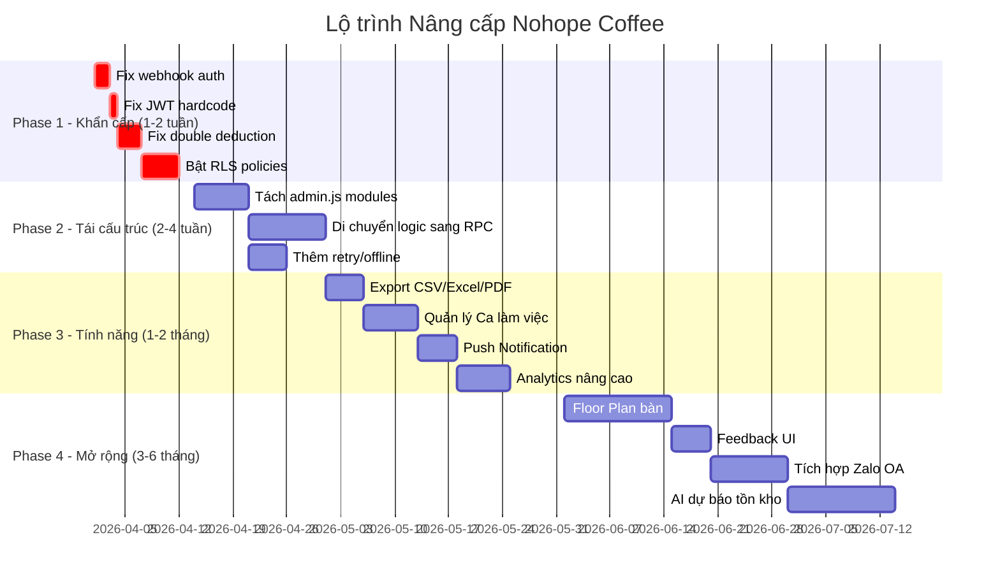

# 🔬 PHÂN TÍCH & ĐỀ XUẤT NÂNG CẤP HỆ THỐNG NOHOPE COFFEE

> Phân tích dựa trên audit toàn bộ mã nguồn: `customer.js` (1974 dòng), `admin.js` (3538 dòng), `kitchen.js` (864 dòng), `tv.js` (154 dòng), `schema.sql`, `v2_upgrades.sql`, `auth.controller.js`, `webhook.controller.js`, `app.js`, `sw.js`.

---

## 🔴 MỨC ĐỘ KHẨN CẤP — Rủi ro Bảo mật & Lỗi tiềm ẩn

> [!CAUTION]
> Các vấn đề sau nếu không xử lý sẽ gây mất dữ liệu hoặc lỗ hổng bảo mật nghiêm trọng khi vận hành thực tế.

### 1. ❌ Webhook Thanh toán không xác thực nguồn gốc
**File:** [webhook.controller.js](file:///c:/Users/khoal/OneDrive/Máy tính/cafe_qr_production_backup/src/controllers/webhook.controller.js)

Hiện tại endpoint `/api/webhook/payment` **không kiểm tra chữ ký (signature)** của request. Bất kỳ ai biết URL đều có thể gửi POST request giả mạo để đánh dấu đơn hàng là "Đã thanh toán" mà không cần chuyển khoản thật.

```diff
 const handlePaymentWebhook = async (req, res) => {
+    // Xác thực SePay/Casso signature
+    const signature = req.headers['x-sepay-signature'] || req.headers['authorization'];
+    if (!signature || signature !== process.env.WEBHOOK_SECRET) {
+        return res.status(401).json({ error: 'Unauthorized webhook' });
+    }
     try {
         const payload = req.body;
```

### 2. ❌ JWT Secret Hardcode mặc định
**File:** [auth.controller.js](file:///c:/Users/khoal/OneDrive/Máy tính/cafe_qr_production_backup/src/controllers/auth.controller.js#L3)

```javascript
const JWT_SECRET = process.env.JWT_SECRET || 'super_secret_key_123';  // ⚠️ Nếu quên set env, dùng key mặc định
const ADMIN_PASSWORD = process.env.ADMIN_PASSWORD || 'admin123';       // ⚠️ Mật khẩu admin mặc định
```

Nếu triển khai production mà quên cấu hình biến môi trường, hệ thống sẽ chạy với mật khẩu `admin123` — bất kỳ ai cũng vào được admin.

**Khắc phục:** Xóa fallback và throw error nếu thiếu env.

### 3. ❌ Trừ kho 2 lần (Double Deduction)
**File:** [kitchen.js](file:///c:/Users/khoal/OneDrive/Máy tính/cafe_qr_production_backup/public/js/kitchen.js#L310-L366) + [v2_upgrades.sql](file:///c:/Users/khoal/OneDrive/Máy tính/cafe_qr_production_backup/database/v2_upgrades.sql)

Hiện tại hệ thống có **2 nơi trừ kho**:
- RPC `place_order_and_deduct_inventory` trừ kho khi đặt đơn (server-side)
- `kitchen.js` lại trừ kho lần nữa khi bếp bấm "Completed" (client-side, dòng 310-366)

→ Kết quả: **Mỗi đơn hàng bị trừ kho GẤP ĐÔI** nếu cả 2 logic cùng chạy.

**Khắc phục:** Chọn 1 trong 2 — giữ RPC (an toàn hơn) và xóa logic trừ kho trong `kitchen.js`.

### 4. ❌ RLS bị tắt gần hết
**File:** [schema.sql](file:///c:/Users/khoal/OneDrive/Máy tính/cafe_qr_production_backup/database/schema.sql#L145-L149)

Các bảng quan trọng (`orders`, `products`, `ingredients`, `customers`) đều **chưa bật Row Level Security**. Bất kỳ ai có `SUPABASE_ANON_KEY` (public key, nằm ngay trong mã nguồn frontend) đều có thể đọc/ghi/xóa toàn bộ dữ liệu.

---

## 🟠 MỨC ĐỘ QUAN TRỌNG — Kiến trúc & Code Quality

> [!WARNING]  
> Các vấn đề ảnh hưởng đến khả năng mở rộng, bảo trì và hiệu năng dài hạn.

### 5. File `admin.js` quá lớn (3.538 dòng)
File này chứa **tất cả logic** của admin dashboard: sản phẩm, đơn hàng, kho, nhân viên, khuyến mãi, loyalty, analytics, cashflow. Khó bảo trì và debug.

**Đề xuất tách thành modules:**
| File mới | Chức năng | Dòng ước tính |
|:---|:---|:---|
| `admin-products.js` | CRUD sản phẩm, recipe, options | ~500 |
| `admin-orders.js` | Lịch sử đơn, POS, tables | ~600 |
| `admin-inventory.js` | Nguyên liệu, nhập kho, thẻ kho | ~500 |
| `admin-staff.js` | Nhân sự, phân quyền | ~400 |
| `admin-analytics.js` | Biểu đồ, thống kê | ~300 |
| `admin-cashflow.js` | Sổ quỹ, KPI | ~300 |
| `admin-core.js` | Init, RBAC, realtime, utils | ~400 |

### 6. Logic nghiệp vụ chạy phía Client (Frontend)
Toàn bộ logic tính toán recipe, trừ kho, tích điểm loyalty đều nằm trong JavaScript phía trình duyệt (`customer.js`, `kitchen.js`). Điều này có nghĩa:
- Khách hàng có thể **mở DevTools sửa giá** trước khi gửi.
- Nhân viên bếp có thể **bỏ qua logic trừ kho** bằng cách gọi trực tiếp Supabase API.

**Đề xuất:** Di chuyển toàn bộ logic nghiệp vụ sang **Supabase Edge Functions** hoặc **PostgreSQL Functions (RPC)**. Frontend chỉ gọi RPC, không tự tính toán.

### 7. Không có Error Boundary / Retry logic
Khi mất kết nối Internet giữa chừng (rất hay xảy ra trong quán cafe WiFi yếu), các thao tác Supabase sẽ thất bại im lặng. Không có cơ chế:
- Retry tự động khi mất mạng
- Queue offline (đặc biệt quan trọng cho bếp)
- Thông báo rõ ràng cho user khi thao tác thất bại

---

## 🟡 MỨC ĐỘ CẢI THIỆN — Tính năng & Trải nghiệm

> [!IMPORTANT]
> Những nâng cấp giúp hệ thống chuyên nghiệp hơn và tăng giá trị kinh doanh.

### 8. Thiếu hệ thống Thông báo Đẩy (Push Notification)
Hiện tại bếp chỉ biết có đơn mới qua tiếng "beep" Web Audio API — nếu tắt tab hoặc khóa màn hình thì mất hoàn toàn.

**Đề xuất:** Tích hợp **Web Push Notifications** qua Service Worker để:
- Bếp nhận thông báo đơn mới ngay cả khi đang ở tab khác
- Quản lý nhận cảnh báo kho sắp hết hàng
- Khách hàng nhận "Món của bạn đã sẵn sàng!"

### 9. Chưa có Xuất báo cáo (Export)
Admin dashboard hiển thị biểu đồ và bảng nhưng **không thể xuất ra file** (CSV/Excel/PDF). Đây là nhu cầu cốt lõi cho kế toán.

**Đề xuất:** Thêm nút export cho:
- Lịch sử đơn hàng → CSV/Excel
- Sổ quỹ thu chi → Excel (with formulas)
- Báo cáo doanh thu theo ngày/tuần/tháng → PDF

### 10. Thiếu hệ thống Quản lý Ca làm việc (Shift Management)
Không có tính năng mở/đóng ca. Khi thu ngân đổi ca, không có cơ chế:
- Kiểm đếm quỹ đầu ca / cuối ca
- Tách doanh thu theo từng ca
- Đối soát tiền mặt vs. chuyển khoản theo ca

### 11. Analytics hạn chế
Biểu đồ hiện tại chỉ có:
- Doanh thu theo ngày (Line chart)
- Doanh thu theo danh mục (Doughnut)
- Top 5 món bán chạy

**Nâng cấp đề xuất:**
- Biểu đồ so sánh tuần này vs tuần trước
- Phân tích giờ cao điểm (Heatmap theo giờ)
- Tỷ lệ hủy đơn và nguyên nhân
- Customer Retention Rate (khách quay lại)
- Giá vốn hàng bán (COGS) vs doanh thu = Biên lợi nhuận thực

### 12. Quản lý Bàn chưa trực quan
Hiện tại bàn chỉ là một số (`table_number` dạng TEXT). Chưa có:
- Sơ đồ bàn trực quan (Floor Plan)
- Trạng thái bàn real-time (Trống / Đang dùng / Chờ dọn)
- Ghép/tách bàn cho nhóm khách lớn

### 13. Chưa có Quản lý Khuyến mãi théo thời gian
Bảng `products` có trường `promo_start_time` và `promo_end_time` nhưng **chưa có logic tự động kích hoạt/tắt** khuyến mãi khi hết thời hạn. Tất cả đều phải thao tác thủ công.

---

## 🟢 MỨC ĐỘ NÂNG CAO — Tính năng tương lai

> [!TIP]
> Các tính năng nâng cao giúp hệ thống cạnh tranh với giải pháp thương mại (KiotViet, Sapo, iPOS).

### 14. Tích hợp AI cho Dự báo Tồn kho
Dựa trên dữ liệu `inventory_logs` + `orders` tích lũy, có thể xây dựng model dự báo:
- Dự đoán nguyên liệu nào sắp hết trong X ngày
- Gợi ý tự động lệnh nhập kho dựa trên lịch sử tiêu thụ
- Cảnh báo sớm khi có biến động bất thường (nghĩa là nhân viên lấy bớt)

### 15. Multi-branch (Đa chi nhánh)
Hiện tại hệ thống chỉ hỗ trợ 1 quán. Nếu mở rộng chuỗi:
- Tách data theo `branch_id`
- Dashboard tổng hợp cross-branch
- Transfer kho giữa các chi nhánh

### 16. Tích hợp Máy in Bluetooth / ESC-POS
Hiện tại in bill qua `window.print()` — phải mở cửa sổ trình duyệt mới. Nên tích hợp thư viện ESC/POS để gửi lệnh trực tiếp đến máy in nhiệt qua Bluetooth hoặc USB.

### 17. Hệ thống Đánh giá & Phản hồi Khách hàng
Bảng `feedback` đã có nhưng **chưa có giao diện** để:
- Khách gửi đánh giá sau khi nhận món
- Admin xem dashboard đánh giá trung bình
- Phản hồi lại khách hàng qua SMS/Zalo

### 18. Tích hợp Zalo OA / SMS
Gửi tin nhắn tự động cho khách hàng:
- "Đơn hàng của bạn đã sẵn sàng!"
- Gửi e-receipt sau khi thanh toán
- Chiến dịch marketing cho khách lâu không quay lại

---

## 📊 BẢNG TÓM TẮT ĐỘ ƯU TIÊN

| # | Vấn đề | Mức độ | Độ khó | Ưu tiên |
|:--:|:---|:--:|:--:|:--:|
| 1 | Webhook không xác thực | 🔴 Khẩn cấp | Dễ | ⭐⭐⭐⭐⭐ |
| 2 | JWT/Password hardcode | 🔴 Khẩn cấp | Dễ | ⭐⭐⭐⭐⭐ |
| 3 | Trừ kho 2 lần (Double Deduction) | 🔴 Khẩn cấp | Trung bình | ⭐⭐⭐⭐⭐ |
| 4 | RLS bị tắt | 🔴 Khẩn cấp | Trung bình | ⭐⭐⭐⭐ |
| 5 | admin.js monolith | 🟠 Quan trọng | Trung bình | ⭐⭐⭐⭐ |
| 6 | Logic chạy phía client | 🟠 Quan trọng | Khó | ⭐⭐⭐ |
| 7 | Không có retry/offline | 🟠 Quan trọng | Trung bình | ⭐⭐⭐ |
| 8 | Push Notification | 🟡 Cải thiện | Trung bình | ⭐⭐⭐ |
| 9 | Export báo cáo | 🟡 Cải thiện | Dễ | ⭐⭐⭐⭐ |
| 10 | Quản lý Ca | 🟡 Cải thiện | Trung bình | ⭐⭐⭐ |
| 11 | Analytics nâng cao | 🟡 Cải thiện | Trung bình | ⭐⭐⭐ |
| 12 | Floor Plan bàn | 🟡 Cải thiện | Khó | ⭐⭐ |
| 13 | Tự động khuyến mãi | 🟡 Cải thiện | Dễ | ⭐⭐⭐ |
| 14 | AI dự báo kho | 🟢 Nâng cao | Khó | ⭐⭐ |
| 15 | Multi-branch | 🟢 Nâng cao | Rất khó | ⭐ |
| 16 | In ESC/POS | 🟢 Nâng cao | Trung bình | ⭐⭐ |
| 17 | Feedback UI | 🟢 Nâng cao | Dễ | ⭐⭐ |
| 18 | Zalo/SMS | 🟢 Nâng cao | Trung bình | ⭐⭐ |

---

## 🗺️ LỘ TRÌNH NÂNG CẤP ĐỀ XUẤT



---

*Phân tích được thực hiện dựa trên source code audit ngày 28/03/2026. Bạn muốn mình bắt tay vào sửa vấn đề nào trước?*
