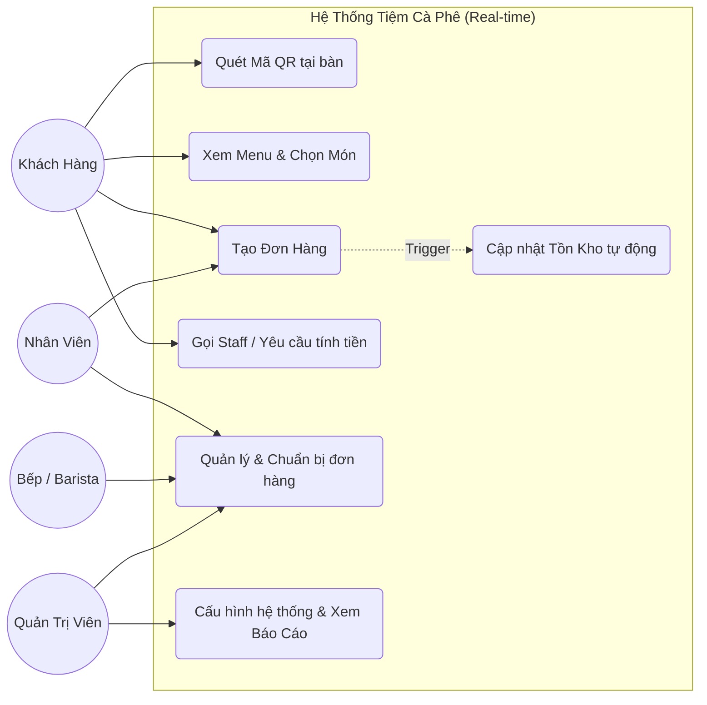
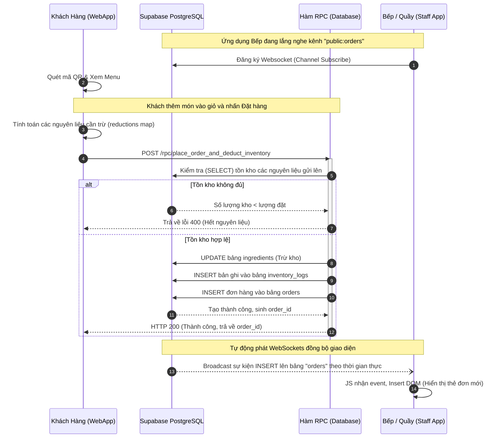

# Tài Liệu Kỹ Thuật: Dự án Nohope Coffee

Đây là tài liệu kỹ thuật mô tả cấu trúc, kiến trúc hệ thống, luồng dữ liệu và hướng dẫn cho dự án hệ thống gọi món theo thời gian thực (Real-time ordering system) của Nohope Coffee.

## 1. Tổng Quan Hệ Thống

Hệ thống Nohope Coffee được thiết kế nhằm phục vụ nhu cầu gọi món tại bàn thông qua mã QR, kết nối thời gian thực giữa Khách hàng, Bếp và Quản trị viên.
Ứng dụng sử dụng mô hình Serverless kết hợp với một máy chủ tĩnh, cho phép dễ dàng triển khai với độ trễ thấp và khả năng mở rộng cao.

### 1.1 Công nghệ sử dụng
- **Frontend**: Vanilla Javascript, HTML5, CSS3, tích hợp TailwindCSS (với PostCSS, Container Queries). Hệ thống theo chuẩn PWA (Progressive Web App) có Service Worker (`sw.js`) để hoạt động như cấu trúc app. Phân tách theo từng trang tĩnh (`index`, `admin`, `kitchen`, `staff`, `login`).
- **Backend / API**:
  - Node.js & Express (Dùng cho Local Development và fallback API như `/api/login`, `/api/webhook/payment`).
  - Vercel Serverless Functions (`api/index.js` wrap Express app).
- **Database (BaaS)**: Supabase (PostgreSQL). Cung cấp Database, Authentication, và Real-time Sync (WebSockets).

---

## 2. Kiến Trúc Dự Án (Architecture)

### 2.1 Cấu Trúc Thư Mục
Dự án áp dụng mô hình tách biệt tĩnh hóa frontend và API serverless.

```text
cafe_qr_production_backup/
├── api/                     # Điểm vào cho Vercel Serverless Functions
│   └── index.js             # Wrap Express App thành serverless function
├── src/                     # Mã nguồn Backend API (Express.js)
│   ├── app.js               # Khởi tạo Express, cài đặt Security Headers & Middleware
│   ├── server.js            # Entry point chạy local (port 3000)
│   ├── routes/              # Chứa các API endpoint (VD: api.routes.js)
│   └── controllers/         # Xử lý logic nghiệp vụ cho API (VD: auth, webhooks)
├── public/                  # Mã nguồn Frontend (Static Assets)
│   ├── pages/               # Các trang giao diện HTML (admin, kitchen, staff, vv...)
│   ├── css/                 # SCSS/Tailwind output (index.css)
│   ├── js/                  # Logic Vanilla JS phía Client (auth, xử lý order)
│   ├── images/              # Tài nguyên hình ảnh
│   ├── manifest.json        # Cấu hình PWA
│   └── sw.js                # Service Worker cho PWA
├── database/                # Schema SQL của Supabase
│   ├── schema.sql           # File DDL khởi tạo toàn bộ các bảng hệ thống
│   └── v2_upgrades.sql      # Script cập nhật hàm RPC và bảng nâng cao (V2)
├── vercel.json              # Cấu hình routing & deployment cho Vercel
├── package.json             # Quản lý dependencies và NPM scripts
└── tailwind.config.js       # Cấu hình UI theo thư viện Tailwind CSS
```

### 2.2 Luồng Logic Phân Rã (Routing)
Do được triển khai qua Vercel (`vercel.json`), hệ thống định tuyến (routing) được chia làm 2 phần:
1. **API Routes (`/api/*`)**: Request được bắt và xử lý bởi `api/index.js` thông qua framework Express. Gồm logic bảo mật, tích hợp thanh toán (SePay/Casso).
2. **Static Routes (`/*`)**: Mọi request khác được map trực tiếp với các file HTML biên dịch sẵn trong `public/pages`. Frontend router logic sẽ lo thao tác với DOM sau khi tải trang.

---

## 3. Cơ Sở Dữ Liệu (Supabase SQL)

Hệ thống sử dụng bảng PostgreSQL qua Supabase. Các bảng trọng tâm gồm:

- `users`: Thông tin đăng nhập Admin / Staff (Kèm mã PIN/Role).
- `products`: Thông tin cấu hình sản phẩm, giá bán, thành phần công thức (recipe array).
- `ingredients` & `inventory_logs`: Quản lý kho nguyên vật liệu và bản ghi (audit log) xuất/nhập/hủy kho.
- `orders`: Lưu trữ đơn hàng khách. Chứa dữ liệu dạng document-store (JSONB) cho `items` giúp linh hoạt.
- `customers` & `point_logs`: Hệ thống điểm khách hàng thân thiết.
- `discounts`: Mã giảm giá (Coupon).
- `staff_requests`: Khách hàng nhấn "Gọi nhân viên / Xin tính tiền" từ thiết bị.
- `table_sessions`: Quản lý cấp phát và phân biệt phiên làm việc (session) khi nhiều khách cùng quét 1 mã bàn.

### Cập Nhật Tồn Kho Nguyên Tử (Atomic Inventory)
Thay vì thực hiện nhiều thao tác API tạo trễ, hệ thống sử dụng Postgres RPC (Remote Procedure Call) - hàm `place_order_and_deduct_inventory` (*định nghĩa trong `v2_upgrades.sql`*).
Tính năng này đảm bảo:
1. Xác thực kho trước: Quét lượng thành phần `reductions`. Nếu thiếu, transaction thất bại (hủy đặt).
2. Trừ tồn kho và ghi log (`inventory_logs`) tức thời.
3. Tạo mới `order` và kết thúc với `commit` ở cấp độ DB.

---

## 4. Các Luồng Dữ Liệu Chi Tiết (Data Flow)

### 4.1. Đăng Nhập Hệ Thống
1. **Admin / Cấp Quản Lý**:
   - Truy cập `/admin`, điều hướng qua `/login`.
   - Client nạp payload về endpoint `/api/login` (Backend).
   - Express backend xác thực với cở sở dữ liệu, nếu trùng khớp, sinh mã JWT và trả cho trình duyệt.
   - Trình duyệt lưu thông tin và mở Dashboard Admin tĩnh.
2. **Nhân Viên (Staff / Kitchen)**:
   - Sử dụng cơ chế mã PIN, truy vấn xác thực trực tiếp qua **Supabase Auth / Postgres (RLS)** ở phía Frontend Client.

### 4.2. Luồng Gọi Món (Customer Ordering)
1. Khách quét QR code chứa URL: `/?table=[số bàn]`.
2. Trình duyệt tải `live_index.html` và nạp menu từ Supabase API (`GET /rest/v1/products`).
3. Khách chọn món và gửi giỏ hàng: Client JS tính toán và tập hợp "reductions" array tham chiếu nguyên liệu.
4. Client gọi trực tiếp hàm RPC `place_order_and_deduct_inventory` lùi kho và lên đơn trên Postgres.

### 4.3. Real-Time Sync (Bếp & Staff)
Sử dụng Supabase Realtime (WebSockets):
- Màn hình Bếp (`kitchen.html`) và Nhân viên (`staff.html`) đăng ký một websocket channel (Vd: `public:orders`).
- Khi DB PostgreSQL có lệnh `INSERT` / `UPDATE` vào table `orders` hoặc `staff_requests`, trigger phát kênh.
- UI DOM ở thiết bị Bếp lập tức render card đơn hàng mới mà không cần re-load trang.

---

## 5. Hướng Dẫn Vận Hành & Phát Triển

### 5.1. Khởi chạy Local (Môi trường Phát Triển)
1. Đảm bảo đã cài `Node.js`.
2. Chạy thư mục root: `npm install`.
3. Khởi tạo file `.env` bằng biến của Supabase:
   ```env
   SUPABASE_URL=https://[ID].supabase.co
   SUPABASE_ANON_KEY=ey...
   SUPABASE_SERVICE_ROLE_KEY=ey... (Sử dụng cho api)
   JWT_SECRET=your_jwt_secret
   ```
4. Build Tailwind CSS (trong trường hợp UI thay đổi):
   - `npm run build:css`
5. Khởi động server ảo:
   - `npm start`
6. Truy cập qua: `http://localhost:3000`.

### 5.2. Chú Ý Khi Sửa Đổi Production
- **CSS**: Frontend phụ thuộc vào output build của Tailwind. Mọi sửa đổi file `.html` hoặc JS cấp class mới phải chạy lệnh build CSS để update `public/css/index.css`.
- **Bảo mật Content-Security-Policy (CSP)**: Được khai báo hardcode trong `src/app.js` cho kết nối local và qua file cấu hình webserver cho production (`vercel.json` headers configs). Nếu tích hợp các script hay CDN mới ngoài Supabase, Vercel, JSdelivr v.v... cần white-list domain ở rule CSP.
- **Database Migrations**: Nếu can thiệp vào Logic bảng, bắt buộc update trong `database/schema.sql` cho mục đích lưu trữ và chia sẻ code với các team khác. Dữ liệu thực tế được quản trị trực tiếp trên Dashboard Supabase.

---

## 6. Sơ Đồ Hệ Thống (UML Diagrams)

### 6.1. Sơ Đồ Use Case (Use Case Diagram)
Biểu đồ mô tả các nhóm tác nhân (Actors) và các nghiệp vụ chính mà họ tương tác với hệ thống.



### 6.2. Sơ Đồ Tuần Tự (Sequence Diagram) - Luồng Đặt Món và Trừ Kho
Mô phỏng chuỗi tương tác thời gian thực từ lúc khách bấm nút Đặt hàng cho tới khi Bếp nhận được thông báo không load lại trang.


