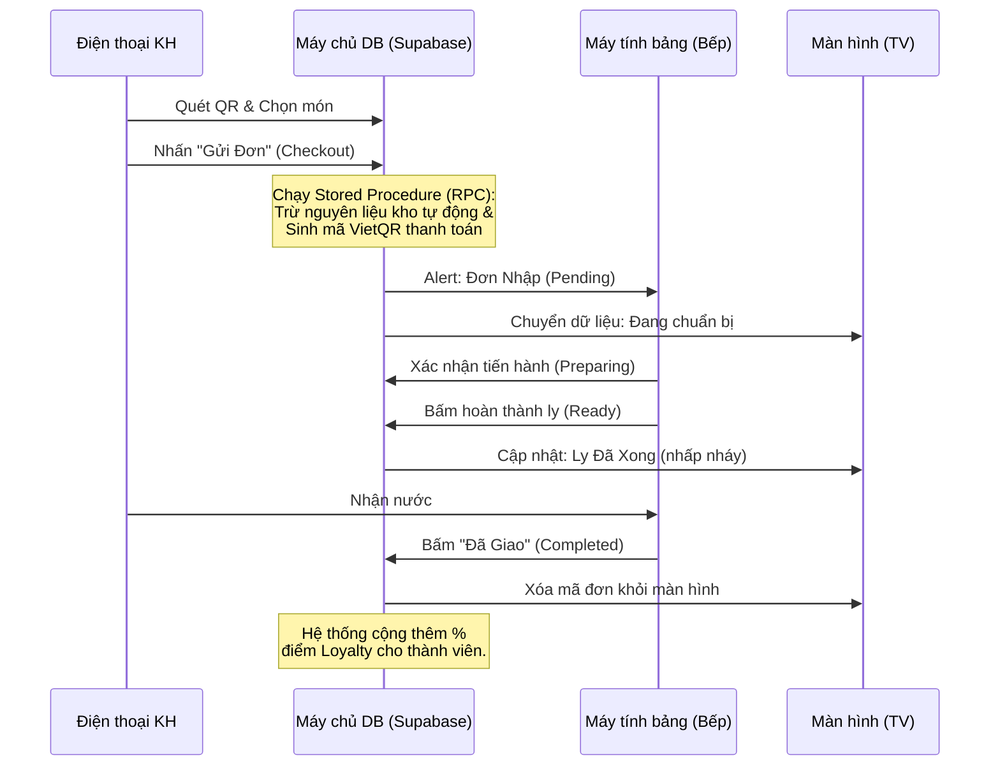

# BÁO CÁO KỸ THUẬT & VẬN HÀNH DỰ ÁN NOHOPE COFFEE

**Phiên bản:** 1.0.0
**Ngày lập báo cáo:** 28/03/2026
**Dự án:** Hệ thống Quản lý Quán Cafe Thời gian thực (Nohope Coffee)

---

## 1. TỔNG QUAN DỰ ÁN

**Nohope Coffee** là một giải pháp chuyển đổi số toàn diện dành cho mô hình quán cafe hiện đại. Hệ thống cải tiến hoàn toàn quy trình phục vụ truyền thống thông qua cơ chế "Tự phục vụ bằng mã QR" (Self-ordering), kết hợp với đồng bộ dữ liệu thời gian thực (Real-time).

### 1.1 Mục tiêu hệ thống
- **Tối ưu hóa nguồn nhân lực:** Giảm tải công việc truyền thống (đi ghi order, thanh toán tay).
- **Tăng tốc độ phục vụ:** Đơn hàng truyền trực tiếp xuống hệ thống KDS (Bếp) trong chưa tới 1 giây.
- **Quản trị chặt chẽ:** Kiểm soát tồn kho chính xác thông qua định mức nguyên liệu (Recipe-based Inventory) và kiểm soát dòng tiền tự động (Cashflow).
- **Nâng cao trải nghiệm khách hàng:** Cung cấp giao diện đặt món trực quan, tích điểm Loyalty hiển thị minh bạch và theo dõi tiến độ đơn hàng qua màn hình TV thông minh.

### 1.2 Kiến trúc Công nghệ (Tech Stack)
- **Frontend:** Vanilla JavaScript, HTML5, CSS3, Tailwind CSS. Giao diện tối ưu theo phong cách hiện đại Glassmorphism và Mobile-first (Tối ưu trải nghiệm màn hình điện thoại).
- **Backend/API:** Node.js (Express) phục vụ định tuyến và bảo mật.
- **Database & Real-time Server:** Supabase (PostgreSQL), tận dụng mạnh mẽ WebSockets (Realtime Channels) và Edge Functions/RPC.
- **Bảo mật & Tích hợp:** JWT (JSON Web Tokens) cho nhân viên, VietQR cho thanh toán tự động, Progressive Web App (PWA - Cài đặt như app gốc).

---

## 2. CÁC PHÂN HỆ CHỨC NĂNG CHÍNH (MODULES)

Hệ thống cung cấp trải nghiệm chuyên biệt cho 4 nhóm đối tượng người dùng chính:

### 2.1 Cổng Khách hàng (Customer Web App)
- **Quét Mã QR & Theo bàn:** Bàn khách sẽ có một mã riêng. Khi quét, hệ thống cấp khóa "Table Lock" phiên làm việc để tránh việc nhiều người quét nhầm cùng lúc gây trùng lặp hóa đơn.
- **Tùy chỉnh Món Nâng cao (Options):** Khách hàng dễ dàng chọn kích cỡ, hạn mức đá, đường hoặc các loại Topping thêm.
- **Thanh toán Di động:** Tự động tạo mã QR VietQR chuyển khoản với số tiền và khóa tham chiếu đơn hàng (Order ID).
- **Gọi Phục Vụ:** Nút ấn liên lạc nhanh chóng gửi cảnh báo kêu tính tiền hoặc hỗ trợ tới thiết bị thu ngân/bếp.

### 2.2 Cổng Bếp / Pha Chế (Kitchen Display System - KDS)
- **Real-time Bảng điều khiển:** Màn hình Dashboard phân loại đơn mới. Kèm âm báo (Ding-dong) nổi bật.
- **Tách gộp đơn:** Bếp có thể xem tách riêng lẻ theo từng hóa đơn, hoặc chế độ xem nhóm số lượng (Ví dụ: Tổng cộng 5 ly Cafe Sữa đang chờ pha).
- **Tiến trình đơn hàng (Pipeline):** `Pending` (Chờ làm) ➔ `Preparing` (Đang pha chế) ➔ `Ready` (Làm xong) ➔ `Completed` (Đã giao hàng).
- **In phiếu chế biến nhiệt (Ticket printer):** In ngay từ trình duyệt để đính lên ly.

### 2.3 Màn hình Trạng thái (TV Display)
- **Không gian hiện đại:** Màn hình ngang đặt ở quầy hoặc sảnh lớn, chia đơn thành hai cột "Đang Chuẩn Bị" và "Đã Xong". Khách tự động thấy mã hóa đơn của mình hiện lên mà không cần gọi tên.
- **Ping âm thanh:** Mỗi khi món ở vòng `Ready`, giao diện tự Pop-up và phát tiếng chuông thu hút sự chú ý.

### 2.4 Bảng điều khiển Quản trị (Admin Dashboard)
- **Hàng hóa & Công thức:** Quản lý món ăn, tùy chọn ép kèm (Options) và định mức công thức tiêu hao cho nguyên liệu gốc.
- **Quản lý Kho (Inventory):** Nhập lô hàng mới (`Import Ticket`), theo dõi thẻ kho biến động, cảnh báo nguyên liệu chạm ngưỡng thấp.
- **Sổ Quỹ (Cashflow):** Đối soát mọi dòng tiền (Thu từ đơn lẻ, chi trả nhập ngũ cốc, chi lương thưởng thủ công). Phân tích hiệu suất doanh thu bằng biểu đồ.
- **Phân quyền Nhân sự:** Quyền hạn Granular chi tiết (Quyền tạo ca, thao tác bếp, thao tác quỹ) và bật tắt ngay lập tức. Cấp quyền qua Email/Mật khẩu.

---

## 3. SƠ ĐỒ LUỒNG NGHIỆP VỤ BIỂU DIỄN 

### 3.1 Luồng Khách hàng Đặt món (Order Operation Flow)

### 3.2 Luồng Trừ Tồn Kho Nguyên Tử (Atomic Inventory Workflow)

Động cơ (Engine) này đảm nhiệm cốt lõi chống thất thoát cho cửa hàng. Nó sử dụng PostgreSQL `Stored Procedure` thay vì xử lý mã ngoài máy chủ.

1. Khách hàng thực hiện đẩy Giỏ hàng lên DB.
2. Trình DB (RPC) tự động duyệt mảng sản phẩm + Topping đi kèm, phân giải ra toàn bộ danh sách Nguyên liệu tiêu hao (Dựa vào `Recipe`).
3. Kiểm tra xem toàn bộ các nguyên liệu đó có **Lớn hơn hoặc =** định lượng cần pha chế không.
4. Nếu *đủ*, hệ thống mở Khóa Giao Dịch (Transaction): Ghi giảm nguyên liệu ở thẻ `ingredients` và tạo hóa đơn lưu vào bảng `orders`. Viết log lưu vết vào thẻ kho `inventory_logs`.
5. Nếu có *một chất liệu* không đủ do người khác lấy mất, giao dịch Hủy Lập Tức (Rollback), văng lỗi từ chối báo về khách hàng.

---

## 4. MÔ TRƯỜNG CƠ SỞ DỮ LIỆU (DATABASE SCHEMA)

| Tên Module Bảng | Chức năng (Business Purpose) |
| :--- | :--- |
| **`products`** | Chứa sản phẩm kinh doanh (Menu, tên món, giá, ảnh minh họa) và JSON lưu hệ `recipe` cấu thành món. |
| **`ingredients`** | Cấu trúc Danh mục Nguyên vật liệu (Sữa, Cafe hạt, Đường...) giá vốn, đơn vị. |
| **`orders`** | Rổ chứa toàn bộ thông tin Đơn hàng, tình trạng, phương thức thanh toán. |
| **`customers`** & **`point_logs`** | Module khách hàng Loyalty, tự động tích lũy cấp bậc Đồng, Bạc, Vàng, Kim Cương. |
| **`cash_transactions`**| Tổ hợp giao dịch (Credit/Debit) dùng để báo cáo lãi lỗ Sổ Quỹ Kế toán độc lập. |
| **`audit_logs`** | Ghi hình dấu vết: Quản lý đăng nhập, Quản lý xóa sửa đơn của User (Chỉ Admin phân xử). |
| **`users` + `staff_permissions`** | Thông tin hồ sơ Nhân viên (Auth Sync) và cấp quyền truy cập cụ thể các Menu Tabs. |

---

## 5. CÔNG NGHỆ BẢO MẬT & PHÂN QUYỀN

- **CSP (Content Security Policy):** Xây dựng hệ thống tường lửa (Headers) phía Request chặn mưu đồ tiêm nội dung lạ vào các cổng Giao diện của nhân viên.
- **Row Level Security (RLS) - Bức tường lửa mức Cơ Sở:** Khách hàng tạm thời chỉ được đọc Menu và thêm đơn. Mọi thao tác Xóa, Xem báo cáo bán hàng, Sửa thông tin đều yêu cầu chuỗi xác thực Bearer JWT của Nhân viên / Quản lý. 
- **Role-Based Access Control (RBAC):** Bảng `staff_permissions` lưu trữ dạng mãng `["orders", "kitchen", "inventory"]`. Tab quản trị sẽ tự động ẩn đi đối với những Staff có cấp bậc bảo mật không hợp lệ nhằm chống rò rỉ Doanh thu.

---

## 6. HƯỚNG DẪN TRIỂN KHAI VÀ BÀN GIAO MÃ NGUỒN

### Cấu trúc mã nguồn:
- Phân tách theo Standard: `public/js/...` (Logic Front-end), `src/` (Express Middleware), `database/` (SQL Migrations).
- Đã thiết lập sẵn tập tin cấu hình Vercel (`vercel.json`) để cho phép Route Clean URL dễ dàng.

### Triển khai hệ thống gốc:
1. Đăng ký tài khoản Supabase, khởi tạo dự án SQL mới.
2. Sao chép và chạy thứ tự `database/schema.sql`, `v2_upgrades.sql`, và `setup_cashflow.sql` vào cửa sổ SQL Editor.
3. Đấu nối Key kết nối qua App (Hoặc nền tảng Vercel Variables):
   - `SUPABASE_URL`: Tên miền của máy chủ.
   - `SUPABASE_ANON_KEY`: Mã định danh phía người dùng.
   - `SUPABASE_SERVICE_ROLE_KEY`: Mã Admin chọc thẳng bỏ qua RLS.
4. Triển khai lệnh môi trường `npm install` và cắm cờ `npm start` / Upload lên Vercel. Máy chủ sẽ tự chạy trên Web toàn cầu. Quản trị viên truy cập đuôi dường dẫn `/admin` để kiểm tra.

---
**Tài liệu này được lập tự động từ codebase hệ thống. Sẵn sàng để chia sẻ / tải xuống sử dụng cho các phòng Kế toán, Chăm sóc Khách hàng (SOP) và Hội đồng kiểm duyệt chất lượng Kỹ thuật.**
