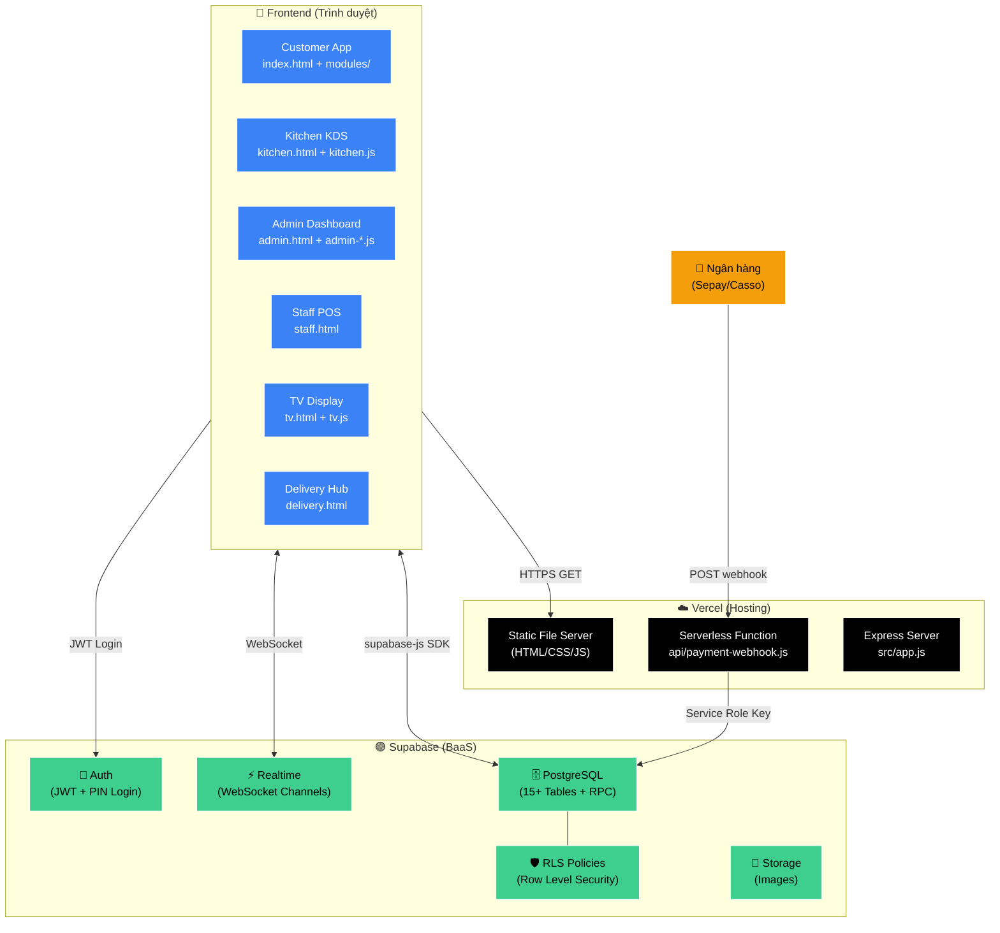
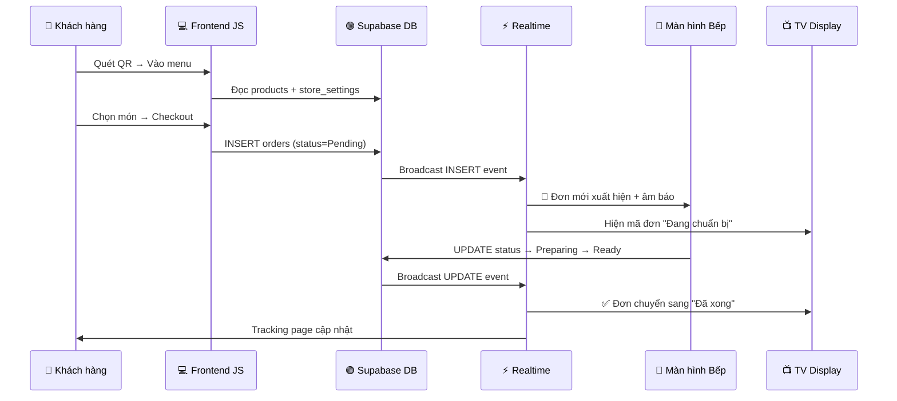

# 🏗 1. Kiến Trúc Hệ Thống (System Architecture)

> [!IMPORTANT]
> Hệ thống sử dụng mô hình **Fat-Client (JAMStack)**: 90% logic chạy trên trình duyệt, kết nối thẳng Supabase. Server chỉ serve file tĩnh + nhận webhook.

## Sơ Đồ Kiến Trúc Tổng Thể

## Tech Stack Chi Tiết

| Layer | Công nghệ | Vai trò |
|-------|-----------|---------|
| **Frontend** | Vanilla JS + Tailwind CSS 3.4 | UI/UX, business logic |
| **Styling** | Glassmorphism + Dark Mode | Design system |
| **Font** | Plus Jakarta Sans + Inter | Typography |
| **Icons** | Font Awesome 6.4 | Biểu tượng |
| **i18n** | Custom i18n.js | Đa ngôn ngữ VI/EN |
| **Backend** | Express 5 + Helmet + Rate Limiter | Security & Routing |
| **Database** | Supabase PostgreSQL | CSDL chính |
| **Realtime** | Supabase Realtime (WebSocket) | Đồng bộ tức thì |
| **Auth** | Supabase Auth + PIN Hash | Xác thực nhân viên |
| **Hosting** | Vercel (Serverless) | Deploy & CDN |
| **Payment** | VietQR + Webhook Auto-verify | Thanh toán tự động |

## Luồng Dữ Liệu Chính

---

👉 **Tiếp theo**: Cấu trúc database chi tiết → [[02_Database_Schema]]
