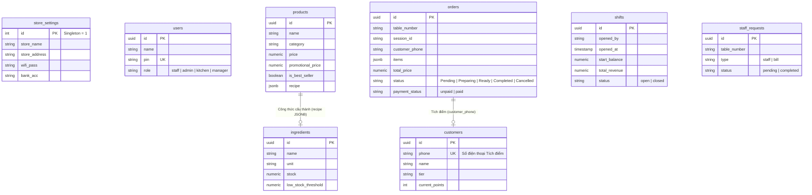

# 🗄 2. Sơ đồ Cơ Sở Dữ Liệu (Database Schema)

Dưới đây là sơ đồ cốt lõi **Thực Thể - Liên Kết (ERD)** của Cafe QR. Cơ sở dữ liệu sử dụng **PostgreSQL** (chạy trên Supabase). 

## Các Bảng Cốt Lõi (Core Tables)
- **`orders`**: Trung tâm của hệ thống. Mỗi khi khách "Add to cart" và Submit, nó lưu vào `orders.items` bằng dạng `JSONB` nhằm chống việc khóa Foreign Key khi sửa xóa sản phẩm, giữ hóa đơn gốc luôn đúng trạng thái lịch sử.
- **`store_settings`**: Là bảng Singleton (Chỉ có ID=1), dùng để Supabase quản lý thông tin cấu hình quán (Wifi, tài khoản nhận tiền).
- **`products` & `ingredients`**: Hệ thống quản lý kho tự động. Khi `orders` được hoàn tất (Completed), hệ thống có khả năng gọi RPC/Tự động trừ `ingredients.stock` thông qua `products.recipe`.

*(Chú ý: Trong Supabase, mọi kết nối Front-end được kiểm soát qua RLS (Row Level Security). Người dùng và khách (vô danh) sẽ có Policy độc lập bảo vệ các hàng truy xuất phù hợp).*

👉 **Tiếp tục với**: [[03_User_Roles]]
