# 🗄 2. Cơ Sở Dữ Liệu (Database Schema)

> [!NOTE]
> Database chạy trên **Supabase PostgreSQL** với 19 lần migration (v2 → v19). Tất cả truy vấn từ frontend đều qua **RLS (Row Level Security)**.

## ERD — Sơ Đồ Thực Thể Liên Kết

```mermaid
erDiagram
    tenants {
        uuid id PK
        text name UK "Tên chi nhánh"
        text slug UK
        text subscription_tier "trial | basic | premium"
        int max_staff
        int max_items
        timestamp expires_at
    }

    users {
        uuid id PK
        text name
        text pin "Hashed PIN"
        text role "staff | admin | kitchen | manager"
        uuid tenant_id FK
        text avatar_url
        jsonb permissions
    }

    products {
        uuid id PK
        text name
        text category
        numeric price
        numeric promotional_price
        boolean is_best_seller
        boolean is_available
        jsonb recipe "Công thức nguyên liệu"
        jsonb options "Size/Topping/Ice..."
        uuid tenant_id FK
    }

    ingredients {
        uuid id PK
        text name
        text unit
        numeric stock
        numeric low_stock_threshold
        uuid tenant_id FK
    }

    orders {
        uuid _id PK
        text table_number
        text session_id
        text customer_phone
        jsonb items "Sản phẩm + note + options"
        numeric total_price
        numeric discount_amount
        text status "Pending→Preparing→Ready→Completed"
        text payment_status "unpaid | paid"
        text payment_method "cash | transfer"
        text payment_ref
        timestamp payment_verified_at
        uuid tenant_id FK
    }

    customers {
        uuid id PK
        text phone UK
        text name
        text tier "Bronze→Silver→Gold→Diamond"
        int current_points
        numeric total_spent
    }

    shifts {
        uuid id PK
        text opened_by
        numeric start_balance
        numeric total_revenue
        text status "open | closed"
    }

    cash_transactions {
        uuid id PK
        text type "credit | debit"
        numeric amount
        text description
        uuid shift_id FK
    }

    inventory_logs {
        uuid id PK
        uuid ingredient_id FK
        text change_type "deduction | restock | spoilage"
        numeric amount
        numeric previous_stock
        numeric new_stock
    }

    delivery_orders {
        uuid id PK
        uuid order_id FK
        text customer_address
        text driver_id
        text delivery_status
    }

    feedback {
        uuid id PK
        uuid order_id FK
        int rating "1-5"
        text comment
    }

    store_settings {
        int id PK "Singleton = 1"
        text store_name
        text bank_acc
        text wifi_pass
        int table_count
    }

    staff_requests {
        uuid id PK
        text table_number
        text type "staff | bill"
        text status "pending | completed"
    }

    audit_logs {
        uuid id PK
        text admin_identifier
        text action
        text details
    }

    promo_banners {
        uuid id PK
        text title
        text image_url
        text type "carousel | popup"
        boolean is_active
    }

    %% Relationships
    users ||--o{ tenants : "Thuộc chi nhánh"
    products ||--o{ tenants : "Thuộc chi nhánh"
    orders ||--o| customers : "Tích điểm"
    orders ||--o{ delivery_orders : "Giao hàng"
    orders ||--o{ feedback : "Đánh giá"
    products }|--o{ ingredients : "Công thức (recipe JSONB)"
    cash_transactions }|--|| shifts : "Thuộc ca"
    inventory_logs }|--|| ingredients : "Biến động kho"
```

## Danh Sách Bảng Theo Module

### 🛒 Module Bán Hàng
| Bảng | Dòng dữ liệu | Mô tả |
|------|:---:|-------|
| `orders` | ~1000+/tháng | Trung tâm hệ thống. Items lưu JSONB giữ lịch sử |
| `products` | ~50-200 | Thực đơn + công thức + tùy chọn |
| `discounts` | ~10-50 | Mã khuyến mãi PERCENT/FIXED |
| `promo_banners` | ~5-10 | Banner quảng cáo carousel/popup |

### 👥 Module Nhân Sự
| Bảng | Mô tả |
|------|-------|
| `users` | Nhân viên với PIN hash + phân quyền RBAC |
| `staff_permissions` | Quyền truy cập chi tiết từng tab |
| `shifts` | Ca làm việc (mở/đóng ca) |
| `staff_requests` | Yêu cầu gọi nhân viên/tính tiền |

### 📦 Module Kho & Tài Chính
| Bảng | Mô tả |
|------|-------|
| `ingredients` | Nguyên liệu + ngưỡng cảnh báo |
| `inventory_logs` | Lịch sử nhập/xuất kho chi tiết |
| `cash_transactions` | Dòng tiền thu/chi theo ca |
| `audit_logs` | Nhật ký thao tác admin |

### 🎖 Module CRM & Loyalty
| Bảng | Mô tả |
|------|-------|
| `customers` | Khách hàng thành viên + tier |
| `point_logs` | Lịch sử tích/tiêu điểm |
| `feedback` | Đánh giá 1-5 sao + bình luận |

### 🏢 Module SaaS Multi-Tenant
| Bảng | Mô tả |
|------|-------|
| `tenants` | Chi nhánh/cửa hàng + gói dịch vụ |
| `store_settings` | Cấu hình quán (bank, wifi, logo...) |

## Migration History

| Version | File | Nội dung |
|---------|------|----------|
| v1 | `schema.sql` | Schema gốc 12 bảng |
| v2 | `v2_upgrades.sql` | Nâng cấp columns |
| v3 | `v3_security.sql` | RLS policies |
| v4 | `v4_delivery.sql` | Module giao hàng |
| v8 | `v8_pin_hashing.sql` | Mã hóa PIN |
| v11 | `v11_saas_upgrade.sql` | Multi-tenant SaaS |
| v17 | `v17_fix_duplicate_pin.sql` | Fix PIN trùng lặp |
| v19 | `v19_security_audit_fixes.sql` | Audit bảo mật |

---

👉 **Tiếp theo**: Phân quyền người dùng → [[03_User_Roles]]
