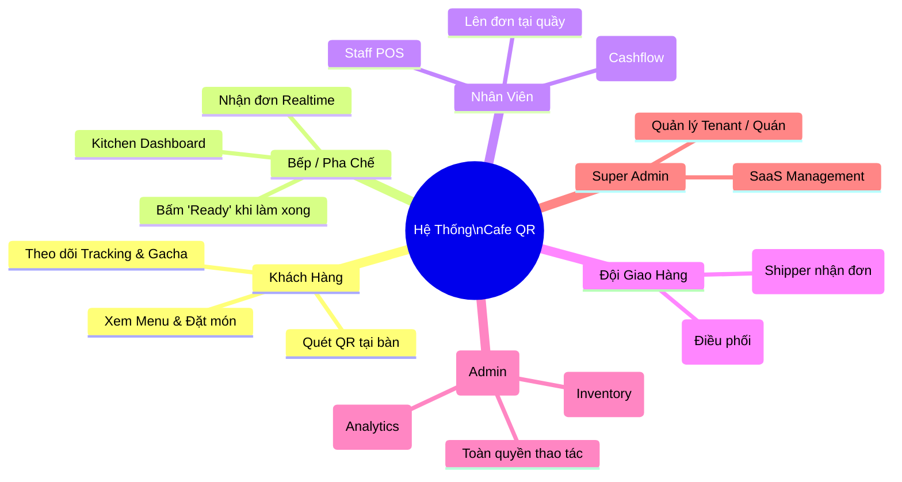

# 🎭 3. Phân Quyền & Vai Trò (User Roles)

Hệ thống được thiết kế với nhiều Dashboard tách biệt (các trang `.html` độc lập dưới `public/pages/`) nhằm tăng cường tính bảo mật và tối ưu trải nghiệm UI/UX cho từng bộ phận.

Dưới đây là cây phân quyền:

## Các Tác Nhân Chính
1. **Customer (Tác nhân vô danh / Khách vãng lai)**: Vào qua `index.html`. Cho phép đặt món trực tiếp từ bàn thay vì chờ đợi.
2. **Staff (Lễ Tân / Thu Ngân)**: Truy cập `staff.html`. Sử dụng mã PIN để đăng nhập trên máy POS chung. Được phép tính tiền, gộp bàn.
3. **Kitchen (Bếp)**: Kiosk Màn hình nằm trong bếp (`kitchen.html`). Rất ít thao tác tay ngoài việc nhấn "Hoàn thành" để chuyển đơn sang cho Staff bưng bê.
4. **Admin (Chủ Quán)**: Truy cập `admin.html`. Có Analytics, Ads management, Menu adjustments.
5. **Driver / Delivery**: Dành riêng cho giao hàng mang đi. `delivery.html` cho quản lý điều phối và `driver.html` cho tài xế xem thông tin bản đồ / đơn.

📝 **Lưu ý kỹ thuật**: Việc rẽ nhánh Router thông qua `app.js` cho phép `domain.com/kitchen` hoặc `domain.com/admin` hoạt động trơn tru là clean URL thay vì file `.html` trực tiếp.

👉 **Tiếp tục với**: [[04_Order_Lifecycle]]
