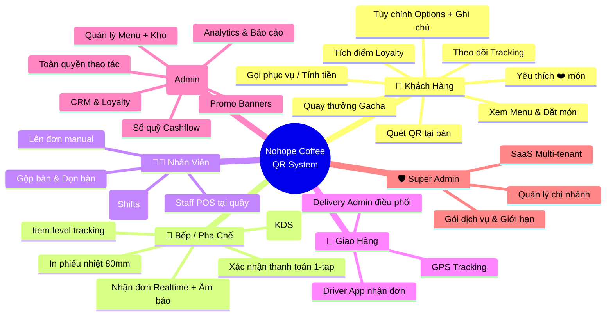
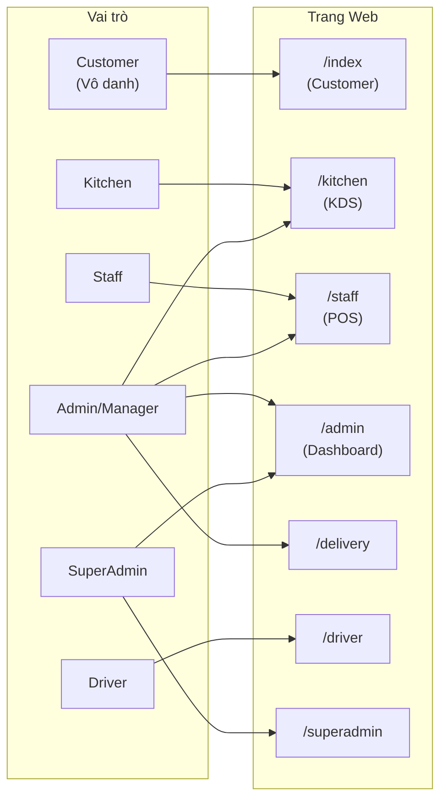

# 🎭 3. Phân Quyền & Vai Trò (User Roles)

Hệ thống phân chia **6 vai trò** với dashboard riêng biệt cho từng bộ phận. Mỗi vai trò có trang `.html` độc lập, xác thực bằng JWT + PIN.

## Sơ Đồ Phân Quyền

## Chi Tiết Từng Vai Trò

### 👤 Customer (Khách hàng — Vô danh)
| Thuộc tính | Chi tiết |
|------------|----------|
| **Trang** | `index.html` (Customer Web App) |
| **Xác thực** | Không cần — truy cập qua QR |
| **Quyền DB** | `SELECT` products, store_settings · `INSERT` orders, feedback, staff_requests |
| **Tính năng** | Menu, Cart, Options, Notes, Favorites, Loyalty, Gacha, Tracking |

### 🍳 Kitchen (Bếp / Pha chế)
| Thuộc tính | Chi tiết |
|------------|----------|
| **Trang** | `kitchen.html` (KDS Dashboard) |
| **Xác thực** | PIN login → role = `kitchen` |
| **Quyền DB** | `SELECT/UPDATE` orders · `SELECT` products |
| **Tính năng** | Nhận đơn, Item tracking, In bill, Xác nhận TT, Lịch sử, Gộp món, Station filter |

### 👨‍💼 Staff (Nhân viên thu ngân)
| Thuộc tính | Chi tiết |
|------------|----------|
| **Trang** | `staff.html` (POS Dashboard) |
| **Xác thực** | PIN login → role = `staff` |
| **Quyền DB** | CRUD orders · `SELECT` products, customers |
| **Tính năng** | POS manual, Gọi phục vụ, Ca làm việc |

### 📊 Admin (Quản lý)
| Thuộc tính | Chi tiết |
|------------|----------|
| **Trang** | `admin.html` (Full Dashboard) |
| **Xác thực** | PIN login → role = `admin` hoặc `manager` |
| **Quyền DB** | Full CRUD tất cả bảng (theo staff_permissions) |
| **Modules** | Menu, Orders, POS, Inventory, Analytics, CRM, Cashflow, Shifts, Delivery, Ads, Tables |

### 🚚 Driver (Tài xế giao hàng)
| Thuộc tính | Chi tiết |
|------------|----------|
| **Trang** | `driver.html` |
| **Xác thực** | PIN login |
| **Tính năng** | Nhận đơn giao, Xem địa chỉ, Cập nhật trạng thái |

### 🛡️ Super Admin (Quản trị SaaS)
| Thuộc tính | Chi tiết |
|------------|----------|
| **Trang** | `superadmin.html` |
| **Xác thực** | Supabase Auth (Email/Password) |
| **Quyền DB** | Bypass RLS (Service Role) |
| **Tính năng** | CRUD tenants, Subscription tiers, Hard-delete cascade |

## Ma Trận Quyền (Permission Matrix)

---

👉 **Tiếp theo**: Vòng đời đơn hàng → [[04_Order_Lifecycle]]
