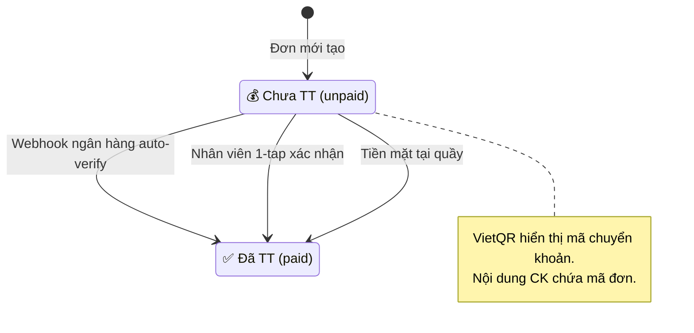
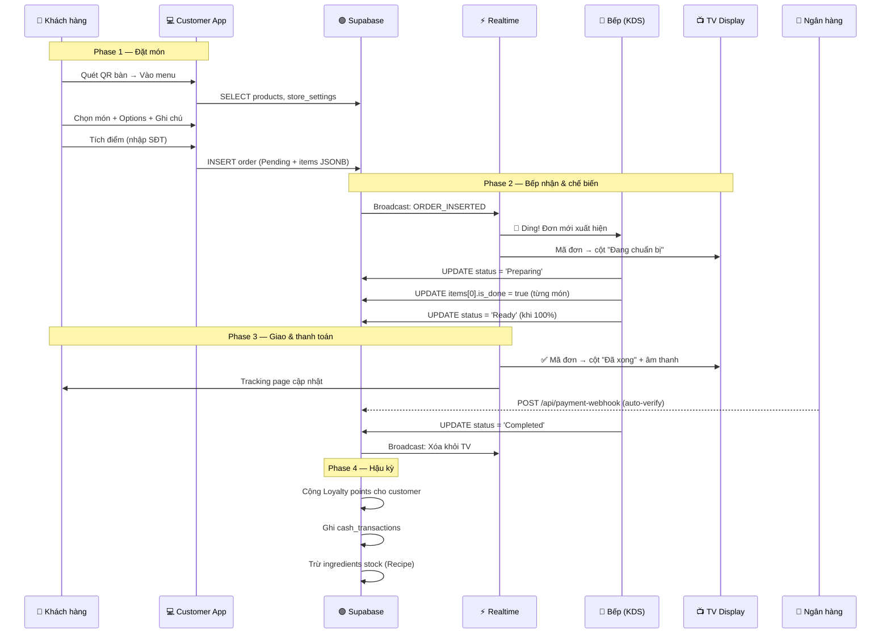

# 🔄 4. Vòng Đời Đơn Hàng (Order Lifecycle)

> [!IMPORTANT]
> Mọi thay đổi trạng thái đều được **Supabase Realtime** broadcast tức thì đến tất cả màn hình (Bếp, TV, POS, Tracking) — không cần reload.

## State Machine — 5 Trạng Thái

```mermaid
stateDiagram-v2
    [*] --> Pending : Khách gửi đơn qua QR

    state "⏳ Chờ Xử Lý (Pending)" as Pending
    state "🔥 Đang Pha Chế (Preparing)" as Preparing
    state "✅ Sẵn Sàng (Ready)" as Ready
    state "📦 Hoàn Thành (Completed)" as Completed
    state "❌ Đã Hủy (Cancelled)" as Cancelled

    Pending --> Preparing : Bếp nhấn "Nhận Đơn"
    Pending --> Cancelled : Hủy đơn

    Preparing --> Ready : Tất cả items xong
    note right of Preparing
        Item-level tracking:
        Mỗi món check ✅ riêng.
        Tự chuyển Ready khi 100%.
    end note

    Ready --> Completed : Staff giao khách
    note right of Ready
        TV Display nhấp nháy.
        Âm thanh thông báo.
    end note

    Completed --> [*] : Cộng điểm Loyalty
    Cancelled --> [*] : Hoàn kho (nếu đã trừ)
```



## Luồng Thanh Toán Song Song



## Luồng Chi Tiết — Từ Quét QR đến Giao Hàng



## Item-Level Tracking (Theo dõi từng món)

Mỗi item trong `orders.items` JSONB có:
```json
{
    "name": "Cafe Sữa",
    "quantity": 2,
    "price": 35000,
    "item_code": "A1",
    "is_done": false,
    "note": "Ít đường",
    "selectedOptions": [
        { "choiceName": "Size L", "priceExtra": 10000 }
    ]
}
```

Khi nhân viên bếp click vào từng món:
- `is_done` → `true`, hiện ✅ xanh
- Thanh progress bar cập nhật %
- Khi 100% items done → Tự động chuyển `Ready`

---

👉 **Tiếp theo**: Cấu trúc mã nguồn → [[05_Frontend_Modules]]
