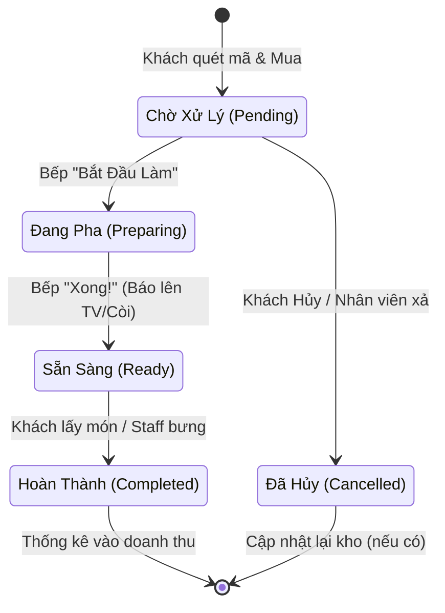

# 🔄 4. Vòng Đời Đơn Hàng (Order Lifecycle)

Một trong những thiết kế quan trọng nhất của hệ thống quán Cafe là trạng thái đơn. Nhờ cơ chế **Supabase Realtime**, khi trạng thái (Status) trong Database thay đổi, mọi màn hình (Kitchen Kiosk, POS Thu ngân, Điện thoại khách) đều tự update mà không cần tải lại trang (reload).

## Lưu Đồ Trạng Thái (State Machine)

## Các Phương Thức Thanh Toán
Nằm song song với Trạng thái đơn là Trạng thái thanh toán (`payment_status` = `paid` hoặc `unpaid`):
1. **Tiền mặt**: Nhân viên thủ công bấm nút "Đã thanh toán".
2. **Chuyển khoản (Webhook/ZNS)**: Một API tích hợp báo về Node `/api/webhook`, tự động update `payment_status = 'paid'` và kích hoạt còi báo cho nhân sự.

👉 **Tiếp tục với**: [[05_Frontend_Modules]]
