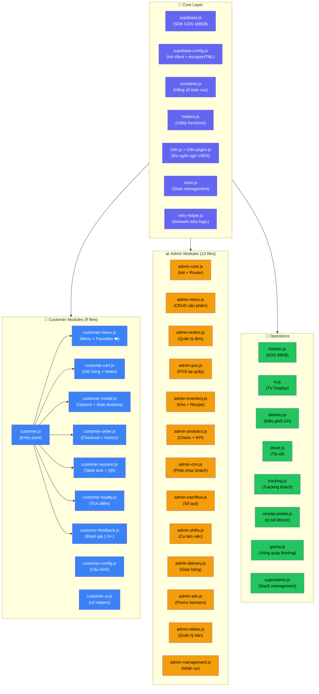

# 💻 5. Cấu Trúc Mã Nguồn Frontend (Modules)

> [!NOTE]
> Kiến trúc **100% Vanilla JS** — không React/Vue. Mỗi trang HTML load các file `.js` cần thiết. Tổng cộng **39 file JS** + **8 file CSS**.

## Sơ Đồ Module Dependency

## Chi Tiết Customer Modules

| File | Size | Chức năng |
|------|------|-----------|
| `customer.js` | 1.2KB | Entry point — load tất cả modules |
| `customer-menu.js` | 27KB | Render menu, filter category, **Favorites ❤️** |
| `customer-cart.js` | 16KB | Giỏ hàng, quantity, **item notes**, tính tổng |
| `customer-modal.js` | 11KB | Modal chọn Options (Size/Topping) + **note textarea** |
| `customer-order.js` | 26KB | Checkout, VietQR, lịch sử, **notes in history** |
| `customer-session.js` | 20KB | Table lock, QR session, device fingerprint |
| `customer-loyalty.js` | 12KB | Tích điểm, tier display, point exchange |
| `customer-feedback.js` | 15KB | Đánh giá 5⭐, comment, submit |
| `customer-config.js` | 3.5KB | Store settings, theme config |
| `customer-ui.js` | 3.4KB | Toast, modal helpers |

## Chi Tiết Admin Modules

| File | Size | Chức năng |
|------|------|-----------|
| `admin-core.js` | 34KB | Tab routing, init, permissions check |
| `admin-menu.js` | 34KB | CRUD products, options, recipe, images |
| `admin-orders.js` | 32KB | Danh sách đơn, filter, detail modal |
| `admin-pos.js` | 38KB | POS tại quầy cho staff |
| `admin-inventory.js` | 28KB | Kho nguyên liệu, import, logs |
| `admin-analytics.js` | 42KB | KPI metrics, charts, revenue analysis |
| `admin-management.js` | 34KB | CRUD nhân viên, phân quyền |
| `admin-shifts.js` | 33KB | Ca làm việc, đối soát |
| `admin-cashflow.js` | 13KB | Sổ quỹ thu/chi |
| `admin-delivery.js` | 31KB | Quản lý giao hàng |
| `admin-crm.js` | 5KB | CRM + RFM segmentation |
| `admin-ads.js` | 11KB | Promo banners management |
| `admin-tables.js` | 16KB | Quản lý sơ đồ bàn |

## CSS Architecture

| File | Size | Phạm vi |
|------|------|---------|
| `styles.css` | 44KB | Global design system + components |
| `index.css` | 82KB | Tailwind compiled output |
| `admin.css` | 14KB | Admin-specific styles |
| `kitchen.css` | 3KB | Kitchen dashboard styles |
| `login.css` | 7KB | Login page styles |
| `gacha.css` | 7KB | Lucky wheel animations |
| `logo.css` | 2KB | Logo & branding |
| `staff.css` | 1KB | Staff POS styles |

---

👉 **Tiếp theo**: Backend & APIs → [[06_Backend_And_APIs]]
