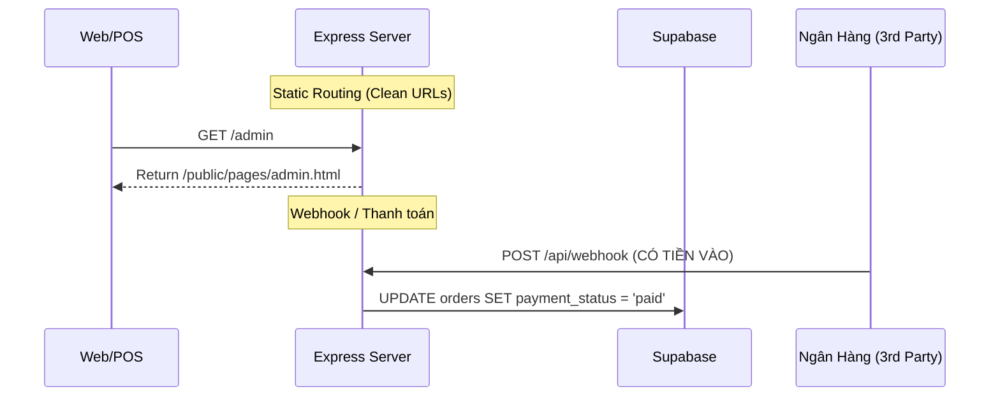

# ⚙️ 6. Backend & APIs Server

Vì phần lớn Data fetching xảy ra trực tiếp ở Database qua Supabase.js Frontend, Node.js Backend (`src/app.js` và `src/server.js`) của dự án này chủ yếu phục vụ các chức năng bổ trợ "Không Thể Làm Ở Frontend" (Bảo mật).

## Express.js Server (`server.js` & `app.js`)

### Các Module Cốt Lõi:
1. **Security & Rate limiting:**
   - Sử dụng thư viện `helmet`: Tự động setup CSP (Content Security Policy) hạn chế clickjacking, ép Cross-Origin.
   - Thư viện `express-rate-limit`: Tránh bị SPAM API Webhook.
2. **Clean URLs Routing:** 
   Giúp người dùng truy cập `domain.com/tv` thay vì `domain.com/pages/tv.html`.
3. **Webhook Controller (`webhook.controller.js`)**: 
   - Điểm API thụ động. Khi Khách hàng chuyển khoản xong, ngân hàng / cổng thanh toán (ví dụ: SePay, cổng thanh toán ngân hàng) sẽ bắn 1 request POST vào URL `domain.com/api/webhook`. 
   - Controller này sẽ check chữ ký bảo mật, nhận diện mã đơn hàng (thông qua nội dung chuyển khoản), và trigger Supabase DB cập nhật trạng thái `payment_status`.

---
Chúc bạn sử dụng Vault này thật tốt để nắm vững hoặc mở rộng dự án! Đóng Vault và mở **Graph View** để xem thành quả.
