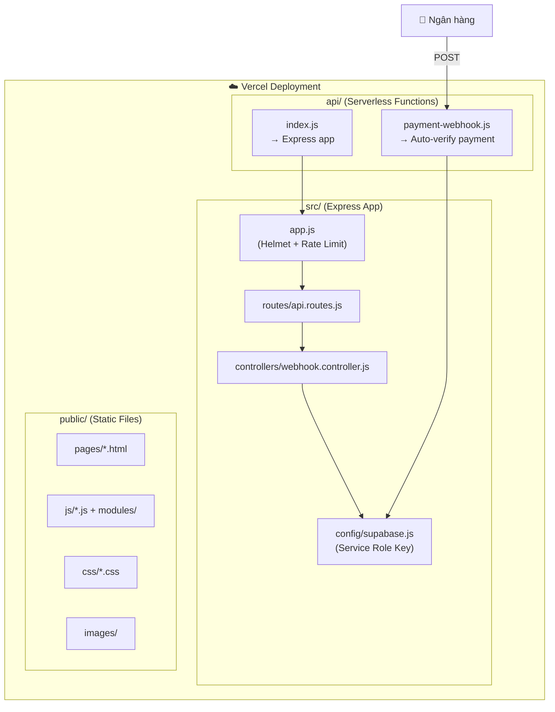
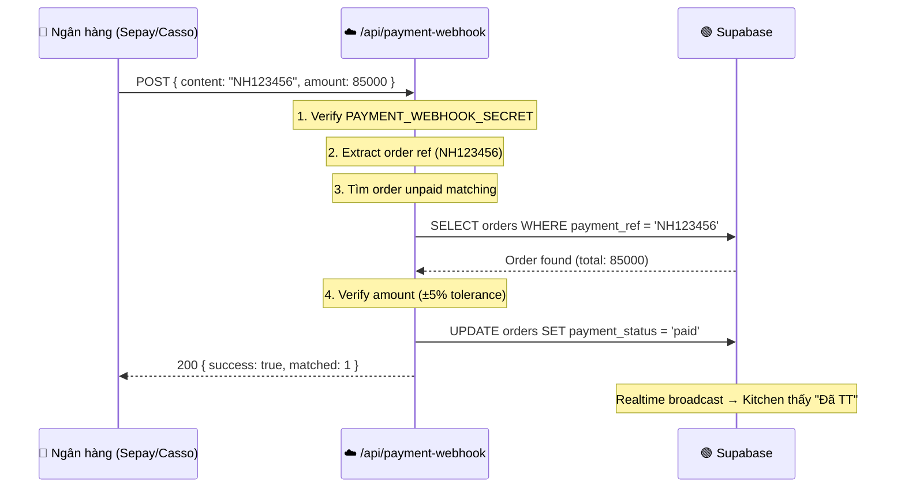

# ⚙️ 6. Backend & APIs

> [!NOTE]
> Backend của hệ thống rất nhẹ — chỉ phục vụ **2 chức năng**: serve file tĩnh (Clean URLs) và nhận webhook thanh toán. 90% logic nằm ở Frontend + Supabase.

## Kiến Trúc Server



## API Endpoints

| Method | Path | Handler | Chức năng |
|--------|------|---------|-----------|
| `GET` | `/*` | Express static | Serve HTML/CSS/JS/Images |
| `POST` | `/api/payment-webhook` | `payment-webhook.js` | Auto-verify chuyển khoản |
| `POST` | `/api/webhook` | `webhook.controller.js` | Legacy webhook handler |

## Clean URL Routing (vercel.json)

```json
{
    "/api/payment-webhook" → "api/payment-webhook.js",
    "/api/*"               → "api/index.js (Express)",
    "/"                    → "pages/index.html",
    "/login"               → "pages/login.html",
    "/admin"               → "pages/admin.html",
    "/kitchen"             → "pages/kitchen.html",
    "/staff"               → "pages/staff.html",
    "/tv"                  → "pages/tv.html",
    "/delivery"            → "pages/delivery.html",
    "/tracking"            → "pages/tracking.html",
    "/driver"              → "pages/driver.html",
    "/guide"               → "pages/guide.html",
    "/superadmin"          → "pages/superadmin.html"
}
```

## Payment Webhook Flow



## Bảo Mật Server-Side

| Layer | Thư viện | Chức năng |
|-------|----------|-----------|
| **CSP** | `helmet` | Content Security Policy, X-Frame chặn clickjacking |
| **Rate Limit** | `express-rate-limit` | Chống spam webhook |
| **Auth** | `PAYMENT_WEBHOOK_SECRET` | Bearer token xác thực webhook |
| **DB Access** | `SUPABASE_SERVICE_ROLE_KEY` | Bypass RLS cho server-side updates |
| **XSS** | `escapeHTML()` | Global utility chống injection |

## Environment Variables

| Key | Mô tả | Nơi dùng |
|-----|--------|----------|
| `SUPABASE_URL` | URL dự án Supabase | Server + Client |
| `SUPABASE_ANON_KEY` | Public key (qua RLS) | Client-side |
| `SUPABASE_SERVICE_ROLE_KEY` | Admin key (bypass RLS) | Server-side only |
| `PAYMENT_WEBHOOK_SECRET` | Secret xác thực webhook | Vercel Function |

---

👉 **Tiếp theo**: Tính năng mới → [[07_New_Features]]
