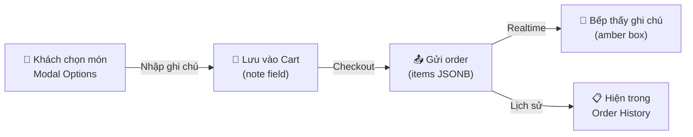
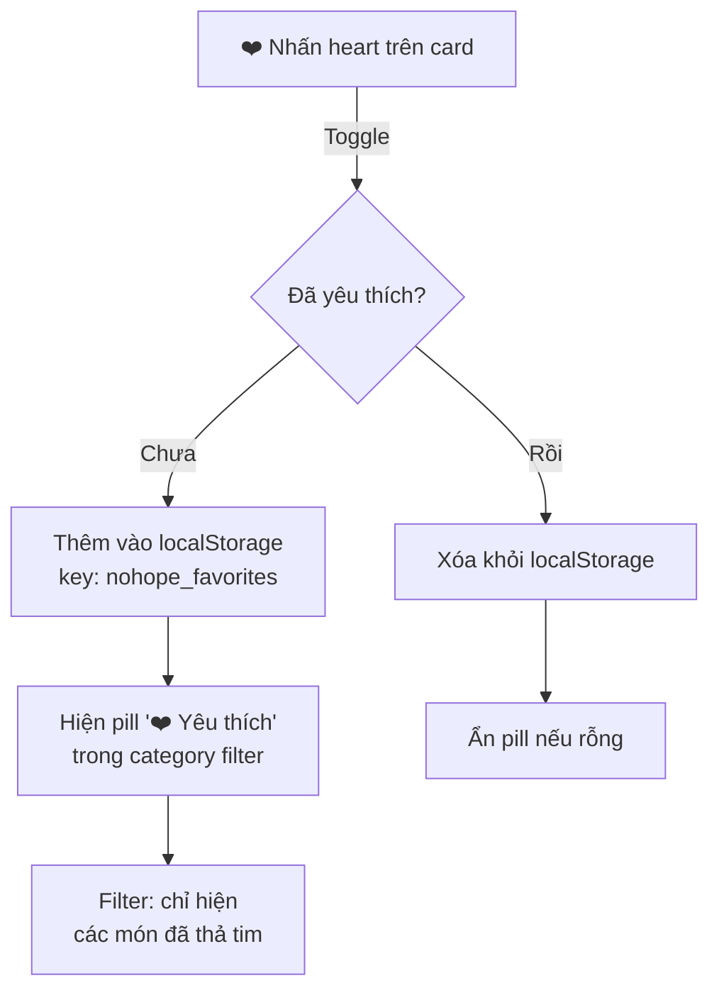
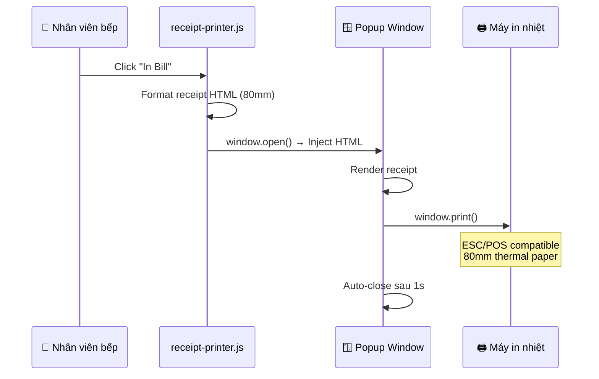
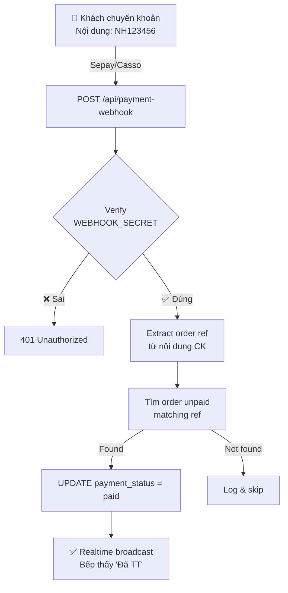
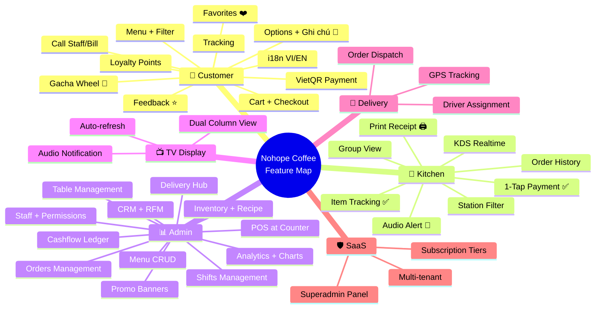

# 🆕 7. Tính Năng Mới (Phase 6+ Features)

> [!TIP]
> Các tính năng dưới đây đã được triển khai thành công ngày **23/04/2026** và push lên production.

## 7.1 Ghi Chú Từng Món (Item Notes) 📝

Cho phép khách hàng thêm ghi chú riêng cho mỗi món khi đặt hàng.

### Luồng hoạt động



### Files liên quan
| File | Thay đổi |
|------|----------|
| `customer-modal.js` | Thêm `<textarea>` ghi chú trong modal options |
| `customer-cart.js` | `handleCartUpdate()` lưu `note` vào cart item |
| `customer-order.js` | Gửi `note` trong payload + hiện trong lịch sử |
| `kitchen.js` | Render note trong khung amber (`bg-amber-50`) |

### Ví dụ dữ liệu
```json
{
    "name": "Cafe Sữa Đá",
    "quantity": 1,
    "price": 35000,
    "note": "Ít đường, nhiều đá",
    "selectedOptions": [...]
}
```

---

## 7.2 Hệ Thống Yêu Thích (Favorites) ❤️

Cho phép khách "thả tim" các món thường xuyên gọi, lọc nhanh khi quay lại.

### Cách hoạt động



### Files liên quan
| File | Thay đổi |
|------|----------|
| `customer-menu.js` | `getFavorites()`, `toggleFavorite()`, render heart button, add filter pill |
| `styles.css` | `.fav-heart-btn` CSS + animation `heartPop` + dark mode |

### Đặc điểm kỹ thuật
- **Persistence**: `localStorage` (key: `nohope_favorites`)
- **Animation**: `heartPop` keyframe — scale bounce khi toggle
- **Dark mode**: Tự động điều chỉnh background/color
- **Responsive**: Circular 32px button, position absolute top-right

---

## 7.3 In Hóa Đơn Nhiệt (Receipt Printer) 🖨️

In bill 80mm trực tiếp từ trình duyệt — không cần driver phần mềm.

### Luồng in



### Nội dung bill in ra
| Phần | Chi tiết |
|------|----------|
| Header | Tên quán + tagline |
| Order ID | Mã 6 ký tự (in lớn) |
| Bàn + Thời gian | Số bàn + ngày giờ |
| Danh sách món | Tên × SL, options, notes, giá |
| Tổng | Tạm tính, giảm giá, **TỔNG CỘNG** |
| Thanh toán | Phương thức + ghi chú đơn |
| Footer | "Cảm ơn quý khách! ☕" |

### File: `receipt-printer.js`
- Font: Courier New (monospace)
- Paper: `@page { size: 80mm auto }`
- Tự động popup + print + close

---

## 7.4 Xác Nhận Thanh Toán Tự Động (Payment Webhook) 💳

### Webhook Flow



### Chiến lược matching
1. **Strategy 1**: Match `payment_ref` column trực tiếp
2. **Strategy 2**: Match order ID suffix (6 digits)
3. **Tolerance**: Chấp nhận ±5% chênh lệch số tiền

### 1-Tap Manual Confirm
Khi webhook chưa kịp bắn, nhân viên bếp có thể nhấn nút **"Chưa TT — Nhấn xác nhận"** trên mỗi order card để update thủ công.

### Files liên quan
| File | Thay đổi |
|------|----------|
| `api/payment-webhook.js` | Vercel serverless function |
| `vercel.json` | Route `/api/payment-webhook` |
| `kitchen.js` | `markOrderPaid()` function + button UI |

---

## Tổng Hợp Tất Cả Tính Năng



---

👉 **Tiếp theo**: Lịch sử phát triển → [[08_Development_Timeline]]
