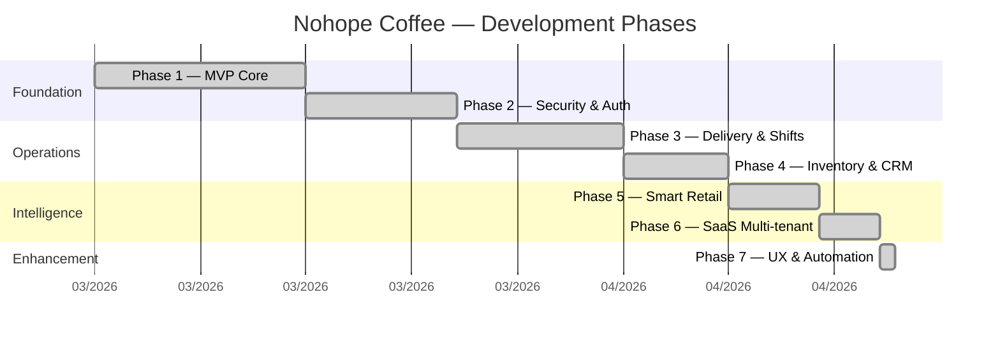

# 📊 8. Lịch Sử Phát Triển (Development Timeline)

> [!NOTE]
> Dự án được phát triển liên tục qua nhiều phase, từ MVP cơ bản đến hệ thống SaaS hoàn chỉnh.

## Timeline Tổng Quan

## Chi Tiết Từng Phase

### Phase 1 — MVP Core 🏗️
> *Nền tảng cốt lõi — Quét QR, Đặt món, Bếp nhận, TV hiển thị*

| Deliverable | Mô tả |
|-------------|--------|
| Customer Web App | Menu, Cart, Checkout qua QR |
| Kitchen KDS | Realtime dashboard + âm báo |
| TV Display | Dual column (Đang làm / Đã xong) |
| Admin Dashboard | Menu CRUD + Orders management |
| Database | Schema gốc 12 bảng PostgreSQL |

### Phase 2 — Security & Auth 🔐
> *Bảo mật, xác thực, phân quyền*

| Deliverable | Mô tả |
|-------------|--------|
| PIN Hashing | bcrypt hash cho mã PIN nhân viên |
| RLS Policies | Row Level Security trên tất cả bảng |
| Helmet + CSP | Content Security Policy headers |
| Rate Limiting | Chống spam API |
| RBAC | staff_permissions bảng quyền chi tiết |
| Audit Logs | Ghi lại mọi thao tác admin |

### Phase 3 — Delivery & Shifts 🚚
> *Giao hàng + Quản lý ca*

| Deliverable | Mô tả |
|-------------|--------|
| Delivery Hub | Quản lý đơn giao hàng |
| Driver App | Tài xế nhận/hoàn thành đơn |
| GPS Tracking | Theo dõi vị trí shipper |
| Shifts System | Mở/đóng ca, đối soát |
| Cashflow | Sổ quỹ thu/chi theo ca |

### Phase 4 — Inventory & CRM 📦
> *Kho thông minh + Quản lý khách hàng*

| Deliverable | Mô tả |
|-------------|--------|
| Recipe Engine | Công thức nguyên liệu JSONB |
| Auto Deduction | Trừ kho tự động khi order |
| Stock Alerts | Cảnh báo nguyên liệu thấp |
| Loyalty Program | Tích điểm Bronze→Diamond |
| VietQR Payment | QR chuyển khoản tự động |

### Phase 5 — Smart Retail 🧠
> *Thông minh hóa vận hành*

| Deliverable | Mô tả |
|-------------|--------|
| KDS Station Routing | Phân luồng Drinks/Food |
| Personalized Upsell | Gợi ý món theo lịch sử mua |
| CRM RFM | Phân khúc khách VIP |
| Analytics Dashboard | KPI metrics + biểu đồ |
| Promo Banners | Carousel/Popup quảng cáo |

### Phase 6 — SaaS Multi-Tenant 🏢
> *Nền tảng đa chi nhánh*

| Deliverable | Mô tả |
|-------------|--------|
| Tenant System | Quản lý nhiều chi nhánh |
| Subscription Tiers | trial / basic / premium |
| Superadmin Panel | CRUD tenants, hard-delete |
| Whitelabel | Logo, color per tenant |
| i18n 100% | Đa ngôn ngữ VI/EN toàn bộ |

### Phase 7 — UX & Automation 🎯
> *Nâng cao trải nghiệm + Tự động hóa*

| Deliverable | Mô tả |
|-------------|--------|
| Item Notes 📝 | Ghi chú riêng từng món |
| Favorites ❤️ | Yêu thích + filter nhanh |
| Receipt Printer 🖨️ | In bill 80mm từ trình duyệt |
| Payment Webhook 💳 | Auto-verify chuyển khoản |
| 1-Tap Payment ✅ | Xác nhận TT thủ công nhanh |
| Item Tracking | Check từng món trong bếp |
| Gacha Wheel 🎰 | Vòng quay thưởng 500 điểm |

---

## Thống Kê Codebase

| Metric | Giá trị |
|--------|---------|
| **Tổng file JS** | 39 files |
| **Tổng file CSS** | 8 files |
| **Tổng HTML pages** | 11 pages |
| **DB Tables** | 15+ tables |
| **DB Migrations** | 19 versions |
| **Admin Modules** | 13 tabs |
| **Customer Modules** | 9 files |
| **Ngôn ngữ** | 2 (VI/EN) |
| **Vai trò** | 6 roles |
| **Hosting** | Vercel (Serverless) |
| **Database** | Supabase PostgreSQL |

---

> [!TIP]
> Mở **Graph View** (`Ctrl+G`) để xem toàn cảnh kết nối giữa các tài liệu trong vault này!

👉 **Quay về**: [[00_Map_Of_Contents]]
