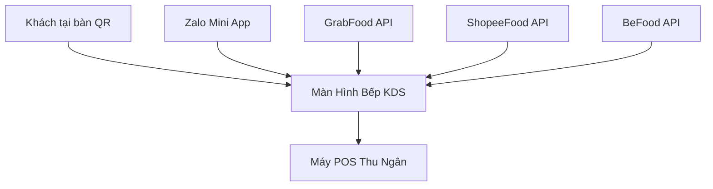

# 🚀 9. Kế Hoạch Mở Rộng Hệ Thống (Future Expansion Roadmap)

> [!NOTE]
> Tài liệu này phác thảo các định hướng phát triển tiếp theo (Phase 8+) để nâng cấp hệ thống Nohope Coffee từ một giải pháp SaaS cơ bản thành một nền tảng quản trị F&B toàn diện và thông minh.

---

## 🤖 Phase 8: AI & Data Intelligence ✅ COMPLETED
Mục tiêu: Biến dữ liệu thành hành động, tăng doanh thu tự động và giảm tải công việc quản lý.

> [!TIP]
> Phase 8 đã triển khai hoàn tất vào 24/04/2026. Tất cả 3 tính năng đều live trên production.

### 8.1 Smart Upsell & Cross-sell ✅
**Files:** `customer-cart.js`, `index.html`
- AI phân tích đa nhân tố: thời gian thực (Sáng/Trưa/Chiều), co-purchase patterns, cross-category pairing, personal history.
- Dynamic UI: Tiêu đề upsell thay đổi theo context (⭐ Yêu thích / 🔥 Hot / ☀️ Thời điểm).
- Hiển thị tối đa 4 món gợi ý trong giỏ hàng.

### 8.2 Sales & Inventory Forecasting ✅
**Files:** `admin-analytics.js`, `admin.html`
- Thuật toán **Weighted Moving Average (WMA)**: Rolling 28 ngày, recency weight + weekday bonus (3x).
- **Forecast Chart**: Biểu đồ dual-line (Thực tế vs Dự báo AI) với đường nét đứt cho forecast.
- **KPI Summary**: Doanh thu dự báo tuần tới, xu hướng %, ngày cao điểm, độ tin cậy mô hình.

### 8.3 AI Admin Assistant (Gemini Chatbot) ✅
**Files:** `api/ai-assistant.js`, `admin-ai-assistant.js`, `vercel.json`
- **Backend**: Vercel Serverless Function → Gemini 2.0 Flash API. Context injection (revenue, orders, top items, low stock).
- **Frontend**: Floating Action Button (FAB) + sliding chat panel + typing indicator + markdown rendering.
- **Quick Prompts**: 4 câu hỏi nhanh (Doanh thu, Top món, Tồn kho, Gợi ý).
- **Security**: API key qua Vercel Env, CORS headers, safety settings.

---

## 🔗 Phase 9: Omnichannel & Ecosystem (Bán Hàng Đa Kênh)
Mục tiêu: Đưa toàn bộ đơn hàng từ mọi nền tảng về một màn hình duy nhất (Centralized KDS).

- **Tích Hợp App Giao Hàng (Aggregator Integration)**: Đồng bộ đơn hàng GrabFood/ShopeeFood/BeFood về chung hệ thống KDS. Không cần dùng nhiều máy tính bảng.
- **Zalo Mini App & Zalo ZNS**: Đưa menu lên Zalo Mini App. Gửi thông báo trạng thái đơn hàng (Đã nhận, Đang làm, Hoàn thành) qua tin nhắn Zalo.
- **Hóa Đơn Điện Tử (E-Invoice)**: Tích hợp API (MISA, VNPT) để tự động phát hành hóa đơn điện tử cho khách hàng có nhu cầu.

---

## 🏢 Phase 10: Enterprise & Franchise Operations (Quản Trị Chuỗi Nhượng Quyền)
Mục tiêu: Cung cấp công cụ mạnh mẽ để quản lý từ 10 đến 100+ chi nhánh.

- **Centralized Dashboard (Báo cáo chuỗi)**: Màn hình giám sát tổng thể cho chủ thương hiệu, so sánh hiệu suất realtime giữa các chi nhánh.
- **Central Kitchen (Bếp Trung Tâm)**: Hệ thống quản lý điều phối nguyên vật liệu từ kho tổng đến các chi nhánh (Purchase Orders, Warehouse Transfers).
- **Advanced HR & Payroll**: 
  - Tích hợp máy chấm công FaceID/Vân tay hoặc chấm công GPS qua điện thoại.
  - Tự động tính lương cuối tháng dựa trên ca làm, OT, và phạt đi trễ.

---

## 🎯 Phase 11: Marketing Automation & Gamification Pro
Mục tiêu: Giữ chân khách hàng (Retention) và biến họ thành người quảng bá (Advocates).

- **Automated Retention Campaigns**: Tự động gửi SMS/Zalo tặng voucher cho:
  - Khách hàng không quay lại sau 30 ngày (Win-back).
  - Khách hàng nhân ngày sinh nhật.
- **Referral Program (Affiliate)**: Mỗi khách hàng có 1 mã QR/Link giới thiệu. Nếu bạn bè quét mã và mua hàng, người giới thiệu được cộng điểm Loyalty.
- **Advanced Gamification**: Nâng cấp vòng quay may mắn thành các sự kiện theo mùa (Thu thập mảnh ghép, Lắc xì lì ngày Tết, Đua top điểm thưởng tháng).

---

## Kiến Trúc Chuyển Đổi Tương Lai (Microservices)

Khi hệ thống phình to, việc tách các dịch vụ là cần thiết:

👉 **Quay về**: [[00_Map_Of_Contents]]
